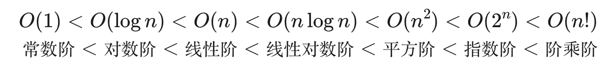

# 数据结构与算法

> 算法在日常生活中无处不在，并不是遥不可及的高深知识。例如，查字典方式与二分查找算法一致，整理扑克的过程与插入排序算法非常类似，货币找零的步骤本质上是贪心算法，每一步都采取当前看来最好的选择。
>
> 本文通过学习《Hello 算法》一书，总结常见的数据结构与算法概念，使用 C++ 实现典型算法问题，整理 leetcode 中的典型题目。

[TOC]

## 什么是算法

算法是在有限时间内解决特定问题的一组指令或操作步骤。

1. 问题明确，有明确的输入输出。
2. 有限步骤、时间和内存空间下完成。
3. 相同输入和运行条件下，输出都相同。

## 算法性能分析

### 复杂度分析

算法性能评估的两个维度：

- 时间效率：运行时间，通过时间复杂度估算。
- 空间效率：占用内存空间大小，通过空间复杂度估算。

复杂度分析能体现算法运行所需时间或空间资源与输入数据大小之间的关系。

#### 时间复杂度

时间复杂度分析是算法运行时间随数据量变大的**增长趋势**。

常见的时间复杂度类型：



#### 空间复杂度

空间复杂度用来衡量算法占用内存空间随着数据量变大时的增长趋势。

一般情况，空间复杂度统计的范围是暂存数据、栈帧空间和输出数据三部分。

降低时间复杂度通常需要以提升空间复杂度为代价，反之亦然。大部分情况下都是通过牺牲内存空间来提升算法运行速度。

### 迭代与递归

#### 迭代

迭代（iteration）是一种重复执行某个任务的控制结构，程序在一定条件下一直重复执行某段代码。

- for 循环：操作数量与输入数据线性关系。
- while 循环：自由度更高，自由控制循环条件，需要具体分析。
- 嵌套循环：操作数量与嵌套层数成次方关系。

#### 递归

递归（recursion）是一种算法策略，通过函数调用自身来解决问题。

- 终止条件：递归什么条件结束继续调用。
- 递归调用：函数调用自身。
- 返回结果：当前递归层级的结果返回上一层。

> 在工作中经常用到递归来遍历多叉树操作，提供的一种思路：首先要明确递归函数的定义，这个函数具体需要做什么操作。
>
> 例如，使用递归遍历删除树节点。我们定义递归函数就是删除以某个节点为根节点的子树；终止条件是根节点为空，即没有子树；返回结果是当前子树是否删除。

```cpp
void deleteSubTree(void *pRoot) {
    void *pChild = nullptr;
    void *pSibling = pRoot;

    if (pRoot == nullptr)  return;

    do
    {
        pChild = getChild(pRoot);
        deleteSubTree(pChild);
    } while (pSibling = getSibling(pSibling));

    delete pRoot;
}
```

**注意事项**：

递归函数每次调用自身，都会为新开启的函数分配内存，保存局部变量、调用地址等信息。所以递归通常比迭代更耗费内存空间。

使用递归函数一定要对递归层数做限时，否则可能会造成内存栈溢出：[正则匹配的栈溢出问题](./regexp_err.md)

## 数据结构

常见的数据结构包括数组、链表、栈、队列、哈希表、树、堆、图。

- 线性结构：数组、链表、栈、队列、哈希表
- 非线性结构：树、堆、图、哈希表


### 基本数据类型

基本数据类型是 CPU 能够直接运算的类型，主要包括：

- 整数类型 `byte`、`short`、`int`、`long` 。
- 浮点数类型 `float`、`double` ，用于表示小数。
- 字符类型 `char` ，用于表示各种语言的字母、标点符号甚至表情符号等。
- 布尔类型 `bool` ，用于表示“是”与“否”判断。

基本数据类型的取值范围取决于占用的内存空间，例如 `char` 类型占用 1 个字节 = 8 比特，可以表示 256(2^8) 个数字。

基本数据类型提供了数据的“内存类型”，数据结构提供了数据的“组织方式”。

### 编码类型

计算机利用特定规则将数据（数字、符号、文字或图像等）信息转换成可以存储的二进制形式。

#### 数字编码

数字在计算机中是以“补码”的形式存储的。

- **原码**：我们将数字的二进制表示的最高位视为符号位，其中 0 表示正数，1 表示负数，其余位表示数字的值。
- **反码**：正数的反码与其原码相同，负数的反码是对其原码除符号位外的所有位取反。
- **补码**：正数的补码与其原码相同，负数的补码是在其反码的基础上加 1 。

#### 浮点数编码

`int` 和 `float` 长度都是 4 字节，为什么 `float` 的取值范围更大？

IEEE 754 标准的浮点数采用不同表示方式，将二进制数分为三部分：

- 符号位：浮点数正负符号。
- 指数位：指数位使得取值范围增大，数值越大，精度越差。
- 分数位

#### 字符编码

通过建立一条字符与二进制之间的对应关系的字符集，计算机可以通过查表完成二进制数到字符的转换。

##### ASCII 字符集

ASCII 是最早出现的字符集，仅能表示英文、数字、标点符号和一些控制字符。


##### Unicode 字符集

Unicode 统一码采用等长存储字符，这样既可以存储 1 字节长度的英文，又可以存储 2 字节中文，但是非常浪费内存空间。

##### UTF-8 编码

UTF-8 目前是最广泛的 Unicode 编码方式，是一种可变长度的编码。

使用 1 到 4 字节表示一个字符。ASCII 字符只需要 1 字节，常用中文需要 3 字节。

## 数组与链表

### 数组

数组是一种线性数据结构，将相同元素类型存储在连续的内存中。

在 C++ 中数组初始化最好设定初始值为 0 避免脏数据。

```c++
int arr[5] = {0};
int *nums = new int[5];
```

数组的特点：

- 连续内存存储，无其他额外结构开销。
- 数组可以 O(1) 时间内随机访问数组任意一个元素。
- 连续存储数据，插入/删除元素需要将该元素之后的所有元素都向后/向前移动。
- 初始化后长度固定，扩容需要重新申请内存并复制已有元素。

应用场景：

- 随机访问序列
- 排序和搜索
- 查找表
- 机器学习：神经网络大量的向量、矩阵和张量之间的线性代数运算。
- 数据结构实现：栈、队列、哈希表、堆、图等。

### 链表

链表是一种线性数据结构，每个元素是一个节点对象，每个节点的内存地址不需要连续，通过内存地址将各节点连接起来。

```cpp
struct ListNode {
  int val; 				// 元素值
  ListNode *next; // 下一节点指针
  ListNode(int x) : val(x), next(nullptr) {}	// 构造函数
};
```

链表的特点：

- 插入/删除节点只需要修改节点的指针即可，时间复杂度为 O(1)。
- 访问节点需要遍历整个链表，时间复杂度为 O(n)。
- 每个节点需要存储下一节点指针，内存开销较大。

数组与链表的效率对比：

|          | 数组                           | 链表           |
| :------- | :----------------------------- | :------------- |
| 存储方式 | 连续内存空间                   | 分散内存空间   |
| 容量扩展 | 长度不可变                     | 可灵活扩展     |
| 内存效率 | 元素占用内存少、但可能浪费空间 | 元素占用内存多 |
| 访问元素 | O(1)                           | O(n)           |
| 添加元素 | O(n)                           | O(1)           |
| 删除元素 | O(n)                           | O(1)           |

应用场景：

- 单向链表通常用于数据结构实现：栈与队列、哈希表、图。
- 双向链表：浏览器历史记录、[LRU 算法](./cache.md)。
- 环形链表：时间片轮转调度算法、数据缓冲区（音视频）。

### 典型题目

- [螺旋矩阵](https://leetcode.cn/problems/spiral-matrix/solutions/2362055/54-luo-xuan-ju-zhen-mo-ni-qing-xi-tu-jie-juvi) - 所有螺旋类题目均可使用该思路遍历二维数组。
- [两数之和](https://leetcode.cn/problems/add-two-numbers?envType=study-plan-v2&envId=2024-spring-sprint-100) - 遍历两个链表相加，要考虑进位、两个链表不一样长以及最后一个节点进位的场景。

## 栈与队列

### 栈

栈（stack）是一种遵循先入后出逻辑的线性数据结构。

可以使用数组或链表实现栈。

- 数组实现的栈，入栈和出栈效率高，只有在出发扩容时效率会降低，可能会造成一定的空间浪费。
- 链表实现的栈，扩容灵活，但入栈操作效率相对较低，更节省空间。

### 队列

队列（queue）是一种遵循先入先出规则的线性数据结构。

链表实现的队列比较简单，入队出队直接操作链表的头节点和尾节点即可。

数组实现队列，由于出队后所有元素要向前移动，操作效率低。

使用环形数组来实现队列，但是队列的容量是固定的，如果要扩容需要重新申请内存并复制原来的队列。

```cpp
// 容量比初始化时多一个，末尾留一个哨兵位置
ArrayQueue(int t_capacity) : front(0), rear(0), capacity(t_capacity+1) {
    val = new T[capacity];
}

void push(T t_val) {
    if ((rear + 1) % capacity == front) {
        std::cout << "Queue is full." << std::endl;
        return;
    }
    val[rear] = t_val;
    rear = (rear + 1) % capacity;
}

T pop() {
    if (isEmpty()) {
        std::cout << "Queue is empty." << std::endl;
        throw std::out_of_range("Queue is empty.");
    }
    T res = val[front];
    front = (front + 1) % capacity;
    return res;
}
```

### 典型题目

- [有效的括号](https://leetcode.cn/problems/valid-parentheses?envType=study-plan-v2&envId=2024-spring-sprint-100) - 使用栈判断字符串中的括号是否正确。
- [移除 K 位数字](https://leetcode.cn/problems/remove-k-digits/description/?envType=study-plan-v2&envId=2024-spring-sprint-100)

## 哈希表

哈希表通过建立键 Key 与值 Value 之间的映射实现快速查询。通过 Key 可以在 O(1) 时间内获取到对应的值 Value。

哈希表通过数组实现，由哈希函数将 Key 转换为数组索引。

### 哈希冲突

哈希函数将一个大范围的值转换到固定范围内的值，如果不同的 Key 转换后输出结果相同的情况称为哈希冲突。

- 负载因子：哈希表元素数量除以数组大小，用于衡量哈希冲突的严重程度。Java 中如果负载因子超过 0.75 时哈希表就会扩容至原来的 2 倍。

#### 链式地址

链式地址将发生冲突的元素转换为链表，将所有冲突的键值对存储在同一链表中。

当链表变长时可以转换为 AVL 树或红黑树，将查询时间优化到 O(logn)l。

#### 开放寻址

开放寻址不额外引入数据结构，通过将冲突元素放在数组后面的空位置中，查询时通过多次探测处理哈希冲突。

探测方式包括：

- 线性探测：固定长度向后探测。
- 平方探测：探测步数以平方递增。
- 多次哈希：使用多个哈希函数进行探测。

### 哈希算法

哈希算法决定了键值对的分布情况，应具备以下特点：

- 确定性：相同输入必须产生相同输出。
- 效率高：计算过程足够快。
- 均匀分布：键值对分布越均匀，哈希冲突的概率就越低。

哈希算法其他应用场景：

- 密码存储：密码加密计算后存储。
- 数据完整性校验：数据发送方携带数据的哈希值，接收方重新结算后与发送哈希值进行比较。

常见的哈希算法：

|          | MD5                            | SHA-1            | SHA-2                        | SHA-3               |
| :------- | :----------------------------- | :--------------- | :--------------------------- | :------------------ |
| 推出时间 | 1992                           | 1995             | 2002                         | 2008                |
| 输出长度 | 128 bit                        | 160 bit          | 256/512 bit                  | 224/256/384/512 bit |
| 哈希冲突 | 较多                           | 较多             | 很少                         | 很少                |
| 安全等级 | 低，已被成功攻击               | 低，已被成功攻击 | 高                           | 高                  |
| 应用     | 已被弃用，仍用于数据完整性检查 | 已被弃用         | 加密货币交易验证、数字签名等 | 可用于替代 SHA-2    |


## 参考文献

1. [Hello算法](https://www.hello-algo.com/chapter_hello_algo/)

