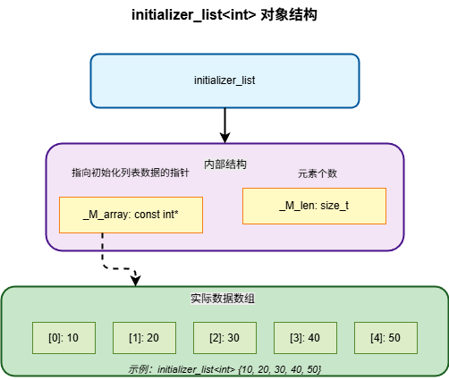

# 初始化列表

`std::initializer_list` 是 C++11 引入的标准库类型，核心作用是**提供对花括号初始化列表（`{}`）的类型化访问**，让函数（尤其是容器构造函数、赋值运算符）能统一处理批量初始化的场景。

[TOC]

## 内部结构

`std::initializer_list` 本质是一个轻量级的只读连续的元素序列视图，不存储数据，仅引用外部数据。

```cpp
// 头文件 <initializer_list>
template<class T>
class initializer_list {
public:
    size_t size() const;
    const T* begin() const;
    const T* end() const;
};
```

两个成员变量：一个指针和一个长度。



编译代码中的初始化列表：`std::vector<int> v = {10, 20, 30, 40, 50}` 

1. 编译器会在栈上分配一块内存存放 5 个 int 值。
2. 编译器创建一个 `initializer_list` 对象，让其中的指针 `_M_array` 指向这个临时数组。
3. 调用 `vector` 的接受 `initializer_list` 对象的构造函数，通过遍历列表将每个元素拷贝到 `vector` 内部的堆内存中。
4. 语句结束后，栈上的临时数组被销毁。

## 核心特性

### 数据存储与生命周期

`std::initializer_list` 本身不存储数据，它引用的通常是在栈上**编译器临时分配的数组**。

当代码中写入 `{1,2,3}` 后，编译器会在栈上创建临时数组，在对应的表达式执行结束后临时数组被销毁。

- 临时数据生命周期与 `initializer_list` 绑定，但仅在**当前完整表达式**内有效。

- 禁止存储 `initializer_list` 的引用 / 指针到表达式外，否则会导致悬空指针。

```cpp
std::initializer_list<int> bad_function() {
    return {1, 2, 3};  // 危险！函数返回会被释放
}
```

### 列表元素不可修改

`std::initializer_list` 列表生成的临时数组是 `const` 类型，无法修改内部元素。

- **临时数组可能在只读内存中**：编译期常量可能会把临时数组放在只读数据段（.rodata）中而不是栈上，可以节省栈空间，也能让多个相同的列表共享同一份数据。
- **避免意外的副作用**：列表可能会多次遍历，防止数据被修改影响后续遍历结果。
- **语义上的合理性**：列表看上去是字面量，不可修改。

### 调用优先级

如果一个类有接受 `initializer_list` 的构造函数，花括号初始化时优先匹配这个构造函数。

```cpp
std::vector<int> v1(10); //10个元素每个都是0
std::vector<int> v2{10}; //1个元素，值为10
```

两阶段重载决议机制，如果第一阶段找不到可行的初始化列表构造函数，就会考虑将初始化列表的元素作为参数查找其他构造函数。

```cpp
std::vector<std::string> v1{10}; //可以编译，但是是10个空字符串
std::vector<std::string> v2(10); //10个空字符串
```

### 额外拷贝的性能问题

`std::initializer_list` 中的元素只能拷贝而不能移动，对于初始化语句中的如果包含大对象的 `std::initializer_list` 可能或有拷贝开销。

C++ 继承了 C 语言的**聚合初始化**特性，临时数组的初始化可以直接将元素写入，不需要现在别处构造再拷贝。对于基本类型和 POD 结构体，使用初始化列表的性能开销可以接受。

对于复杂构造函数类型，拷贝性能开销可能会显现出来：

```cpp
std::vector<std::string> v = {"hello", "world"};
```

1. 两个 `const char*` 字面量被用来构造两个临时 `std::string` 对象。
2. 两个临时对象组成临时数组。
3. `initializer_list` 指向临时数组。
4. `vector` 构造函数遍历 `initializer_list` 把每个 `std::string` 拷贝到堆上。

## 使用场景

1. **批量初始化**：替代手动逐个添加元素，简化代码（如容器初始化）。
2. **函数参数简化**：让函数支持直观的花括号传参（如 `print({1,2,3})`）。
3. **统一初始化语法**：配合 C++11 统一初始化（`{}`），替代括号 / 等号初始化的歧义。
4. **枚举/配置项传递**：传递一组固定的配置值（如 `set_options({opt1, opt2, opt3})`）。

