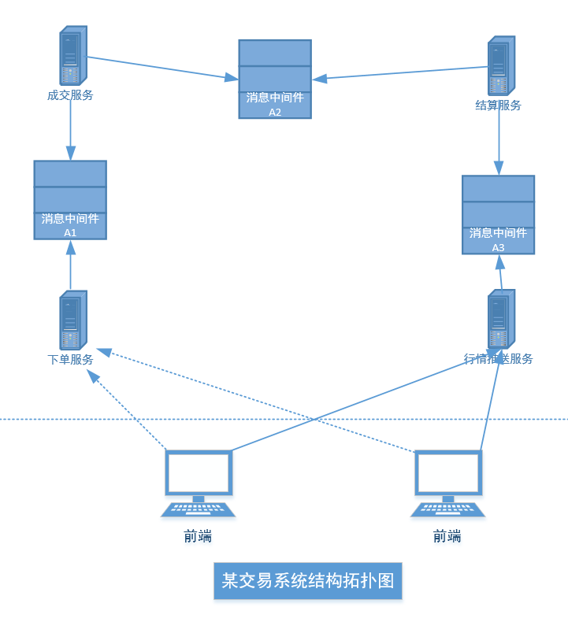

# 线程池

线程池就是**提前创建好一批线程，放在 “池子” 里复用**的线程管理工具，不用每次执行任务都新建 / 销毁线程。

[TOC]

## 设计原理

线程池的核心设计思想：**预先创建线程 + 任务队列缓冲 + 动态线程管理 + 拒绝兜底**，本质是用**空间换时间、复用换性能**。

1. 任务队列：存放还没有执行的任务，线程从队列中阻塞取任务，没有任务就休眠不占用 CPU。
2. 核心线程：常驻线程，即使空闲也不会销毁。
3. 最大线程：任务队列满后临时创建新的线程直到最大值，任务消费后回收。
4. 拒绝策略：线程数达到最大值后任务队列也满，通过丢弃老任务，或者调用者自己执行等策略处理。

```cpp
/** 
 * 任务池模型，TaskPool.h
 * zhangyl 2019.02.14
 */
#include <thread>
#include <mutex>
#include <condition_variable>
#include <list>
#include <vector>
#include <memory>
#include <iostream>

class Task
{
public:
    virtual void doIt()
    {
        std::cout << "handle a task..." << std::endl;
    }

    virtual ~Task()
    {
        //为了看到一个task的销毁，这里刻意补上其析构函数
        std::cout << "a task destructed..." << std::endl;
    }
};

class TaskPool final
{
public:
    TaskPool();
    ~TaskPool();
    TaskPool(const TaskPool& rhs) = delete;
    TaskPool& operator=(const TaskPool& rhs) = delete;

public:
    void init(int threadNum = 5);
    void stop();

    void addTask(Task* task);
    void removeAllTasks();

private:
    void threadFunc();

private:
    std::list<std::shared_ptr<Task>>            m_taskList;
    std::mutex                                  m_mutexList;
    std::condition_variable                     m_cv;
    bool                                        m_bRunning;
    std::vector<std::shared_ptr<std::thread>>   m_threads;
};
```

实现：

```cpp
/**
 * 任务池模型，TaskPool.cpp
 * zhangyl 2019.02.14
 */

#include "TaskPool.h"

TaskPool::TaskPool() : m_bRunning(false)
{

}

TaskPool::~TaskPool()
{
    removeAllTasks();
}

void TaskPool::init(int threadNum/* = 5*/)
{
    if (threadNum <= 0)
        threadNum = 5;

    m_bRunning = true;

    for (int i = 0; i < threadNum; ++i)
    {
        std::shared_ptr<std::thread> spThread;
        spThread.reset(new std::thread(std::bind(&TaskPool::threadFunc, this)));
        m_threads.push_back(spThread);
    }
}

void TaskPool::threadFunc()
{
    std::shared_ptr<Task> spTask;
    while (true)
    {
        {// 减小m_mutexList锁的范围
            std::unique_lock<std::mutex> guard(m_mutexList);
            while (m_taskList.empty())
            {                 
                if (!m_bRunning)
                    break;
                
                //如果获得了互斥锁，但是条件不满足的话，m_cv.wait()调用会释放锁，且挂起当前
                //线程，因此不往下执行。
                //当发生变化后，条件满足，m_cv.wait() 将唤醒挂起的线程，且获得锁。
                m_cv.wait(guard);
            }

            if (!m_bRunning)
                break;

            spTask = m_taskList.front();
            m_taskList.pop_front();
        }

        if (spTask == NULL)
            continue;

        spTask->doIt();
        spTask.reset();
    }

    std::cout << "exit thread, threadID: " << std::this_thread::get_id() << std::endl;
}

void TaskPool::stop()
{
    m_bRunning = false;
    m_cv.notify_all();

    //等待所有线程退出
    for (auto& iter : m_threads)
    {
        if (iter->joinable())
            iter->join();
    }
}

void TaskPool::addTask(Task* task)
{
    std::shared_ptr<Task> spTask;
    spTask.reset(task);

    {
        std::lock_guard<std::mutex> guard(m_mutexList);             
        m_taskList.push_back(spTask);
        std::cout << "add a Task." << std::endl;
    }
    
    m_cv.notify_one();
}

void TaskPool::removeAllTasks()
{
    {
        std::lock_guard<std::mutex> guard(m_mutexList);
        for (auto& iter : m_taskList)
        {
            iter.reset();
        }
        m_taskList.clear();
    }
}
```

## 消息中间件

消息中间件是**分布式系统里负责传递消息的中间组件**，核心作用是让不同服务之间**异步、解耦、削峰**地通信。

- 本质：一个**消息队列（MQ）**，发送方把消息丢进去就不管，接收方慢慢取来处理。
- 核心作用：
  1. **解耦**：服务之间不直接调用，互不依赖
  2. **异步**：不用同步等待，提高响应速度
  3. **削峰**：流量突增时先缓存消息，避免系统被打垮
- 常见产品：RabbitMQ、RocketMQ、Kafka、ActiveMQ 等



交易流程如下：

1. 前端通过 HTTP 请求向**下单服务**请求下单，下单服务校验数据后向**消息中间件 A1** 投递下单请求。
2. **成交服务**订阅了**消息中间件 A1** 的消息，取出下单请求，结合自己的成交规则，如果可以成交，向**消息中间件 A2 **投递一条成交后的消息。
3. **结算服务**订阅了**消息中间件 A2**，从其中拿到成交消息后，对用户资金账户进行结算，结算完成后，用户的下单就算正式完成了，然后产生一条行情消息投递给**消息中间件 A3**。
4. 行情推送服务器从**消息中间件 A3** 中拿到行情消息后推送给所有已经连接的客户端。