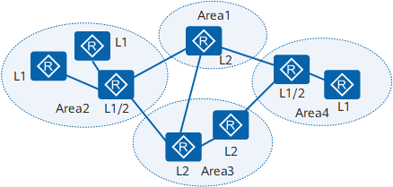
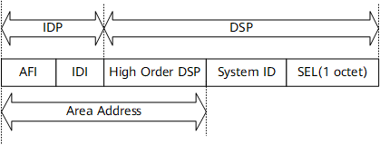
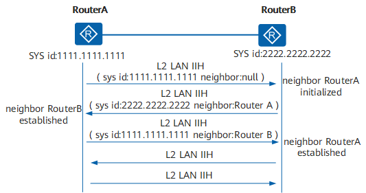
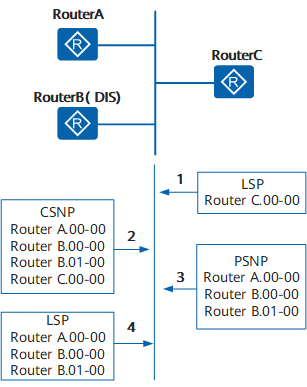

# IS-IS 协议

中间系统到中间系统IS-IS（Intermediate System to Intermediate System）属于内部网关协议IGP（Interior Gateway Protocol），用于自治系统内部。IS-IS也是一种链路状态协议，使用最短路径优先SPF（Shortest Path First）算法进行路由计算。

[TOC]

## 基本概念

IS-IS 协议支持大规模的路由网络，采用骨干区域和非骨干区域两级分层结构。

Level-1 路由器部署在非骨干区域，Level-2 路由器和 Level-1-2 路由器部署在骨干区域。每一个非骨干区域都通过 Level-1-2 路由器与骨干区域相连。

- 每个路由器都只属于一个区域。OSPF 中一个路由器的不同接口可以属于不同区域。
- 单个区域没有骨干和非骨干区域的概念。OSPF 中 Area 0 定义为骨干区域。
- Level-1 和 Level-2 级别的路由都采用 SPF 算法，分别生成最短路径树SPT。OSPF 中只有在同一个区域内才使用 SPF 算法，区域之间的路由需要通过骨干区域来转发。

### 路由器分类

- Level-1 路由器：负责区域内路由。
  - 同一区域的 Level-1 和 Level-1-2 路由器形成邻居关系。
  - 只负责维护 Level-1 的 LSDB，包含本区域的路由信息。
- Level-2 路由器：负责区域间的路由。
  - 与同一区域或不同区域的 Level-2 路由器，也可以与同一区域或不同区域的 Level-1-2 路由器形成邻居关系。
  - 维护的 LSDB 包含区域间的路由信息。
  - 形成 Level-2 邻居关系的路由器组成骨干网，必须是物理连接保证骨干网的连续性。
  - 只有 Level-2 路由器才能直接与区域外的路由器交换数据报文或路由信息。
- Level-1-2 路由器：同时属于 Level-1 和 Level-2 路由器。
  - 可以与同一区域的 Level-1 和 Level-2 路由器形成 Level-1 邻居关系，也可以与同一区域或不同区域的 Level-2 和其他区域的 Level-1-2 形成 Level-2 邻居关系。
  - 维护两个 LSDB，分别用于区域内路由和区域间路由。

### DIS 和伪节点

IS-IS 在所有路由器中选举一个作为 DIS，用来创建和更新伪节点（Pseudonode），负责生成伪节点的链路状态协议数据单元 LSP，描述网络上的网络设备。

伪节点：模拟广播网络的虚拟节点，使用 DIS 的 System ID 和 Circuit 标识。用于简化网络拓扑，使路由器产生的 LSP 长度较小。

- 优先级为 0 的路由器也参与 DIS 选举。
- 新路由器加入且符合成为 DIS 条件时，会被选举为新的 DIS，原来的伪节点被删除。OSPF 新加入路由器不会被选举为 DR。
- IS-IS 广播网络上所有路由器之间都形成邻接关系，LSDB 同步依然靠 DIS 保证。OSPF 路由器只和 DR 和 BDR 建立邻接关系。

### 地址结构

网络服务访问点 NSAP 是 OSI 协议用于定位资源的地址。IS-IS 中用来标识唯一的路由器，主机节点实现通信寻址。

- IDP 相当于 IP 地址的主网络号，AFI 表示地址分配机构和地址格式，IDI 指示服务类型。
- DSP 相当于 IP 地址的子网号和主机地址，High Order DSP 用来分割区域，System ID 用来区分主机，SEL（NSAP Selector）用来指示服务类型。

### 报文类型

- Hello PDU 报文（IIH，IS-to-IS Hello）：建立和维持邻居关系，不同级别（L1/L2）和网络类型（LAN/P2P）的报文格式不同。
- LSP 报文：链路状态报文用于交换链路状态信息。
  - ATT 字段：Level-1 LSP 可以通过 Level-1-2 发到区域外部。
  - OL 字段：过载标志位，通过过载路由器的路由时不会被采用。
  - IS Type 字段：指明生成 LSP 的 IS-IS 类型是 Level-1 还是 Level-2。
- SNP 报文：序列号报文 SNP，描述全部或部分数据库中的 LSP 用于同步 LSDB。
  - CSNP：包括 LSDB 中全部 LSP 的摘要信息，在相邻路由器保持 LSDB 同步。广播网络中 DIS 定期发送，点对点链路上在第一次建立邻接关系时发送。
  - PSNP：最近收到的一个或多个 LSP 的序号，一次对多个 LSP进行确认，LSDB 不同步时使用 PSNP 请求邻居发送新的 LSP。

## 基本原理

每台路由器生成一个 LSP，包含所有使能 IS-IS 协议接口的链路状态信息。

通过跟相邻设备建立 IS-IS 邻接关系，互相更新 LSDB 实现同步。根据 LSDB 运用 SPF 算法计算出路由。

### 建立邻居关系

两台 IS-IS 路由器交互协议报文前必须建立邻居关系。

#### 广播网络建立邻居关系

1. Router A 组播发送 Level-2 LAN IIH，报文无邻居标识。
2. Router B 收到报文将自己和 Router A 邻居标识为 Initial，回复 Level-2 LAN IIH 标识 Router A 为 Router B 的邻居。
3. Router A 收到报文将自己与 Router B 邻居标识为 Up，回复一个标识 Router B 为 Router A 邻居的 Level-2 LAN IIH 报文。
4. Router B 收到报文将自己与 Router A 邻居标识为 Up。两个路由器成功建立邻居关系。

广播网络需要选举 DIS，邻居关系建立后等待两个 Hello 报文间隔再进行 DIS 选举。

Hello 报文中的 Priority 字段最大的被选举为 DIS，优先级相同选举接口 MAC 地址最大。

#### P2P 链路建立邻居关系

P2P 链路邻居关系建立分为两次握手机制和三次握手机制。

- 两次握手机制：路由器收到对端 Hello 报文，宣布邻居为 Up 状态，建立邻居关系。
- 三次握手机制：三次发送 P2P 的 IS-IS Hello PDU 建立邻居关系。

#### 邻居建立原则

- 同一层次的相邻路由器才可能成为邻居。
- Level-1 路由器的区域号必须一致。
- 链路两段接口的网络类型必须一致。
- 链路两段接口的地址必须在同一网段。

### LSP 交互过程

IS-IS 路由域内的所有路由器都会产生 LSP。产生 LSP 的场景：

- 邻居或接口 UP、Down。
- 引入或区域间的 IP 路由发送变化。
- 接口被赋新的 metric 值。
- 周期性更新。

邻居收到新的 LSP 处理过程：

1. 将接收的 LSP 加入自己的 LSDB 数据库，标记为 flooding。
2. 转发新接收 LSP 到其他接口。
3. 邻居扩散到其他邻居。

LSP 报文泛洪是一个路由器向相邻路由器通告自己的 LSP，相邻路由器再以同样方式将 LSP 报文转发给其他邻居。整个层次内的路由器保持 LSDB 的同步。

 #### 广播链路新加入路由

1. 新加入路由器 Router C 发送 Hello 报文，与广播域中的其他路由器建立邻居关系。
2. 建立邻居关系后，Router C 等待 LSP 刷新定时器超时后让自己 LSP 发送组播地址，所有邻居都将收到 LSP。
3. DIS  将 LSP 加入到 LSDB 中，等待 CSNP 报文超时定时器超时后发送 CSNP 报文，进行网络内的 LSDB 同步。
4. Router C 收到 DIS 的 CSNP 报文，对比自己 LSDB 后向 DIS 发送 PSNP 报文请求自己没有的 LSP。
5. DIS 收到 PSNP 报文请求后向 Router C 发送对应的 LSP 进行 LSDB 同步。

#### DIS 同步 LSDB 过程

1. DIS 接收到 LSP，在数据库搜索对应记录。数据库没有 LSP 将其加入数据库，广播数据库内容。
2. 收到 LSP 序列号大于本地 LSP 的序列号，替换为新报文，广播数据库内容。收到 LSP 序列号小于本地 LSP 的序列号，向入端口发送本地 LSP 报文。
3. 收到 LSP 和本地 LSP 序列号相同，比较 Remaining Lifetime。
   - Remaining Lifetime 为 0 将本地报文替换，广播数据库内容。
   - Remaining Lifetime 不为 0 但本地 LSP 报文为 0，向入端接口发送本地 LSP 报文。
4. 序列号相同且 Remaining Lifetime 不为 0，比较 Checksum。
   - Checksum 大于本地 LSP，替换报文并广播数据库内容。
   - Checksum 小于本地 LSP，向入端接口发送本地 LSP 报文。
   - Checksum 相同，不转发报文。

