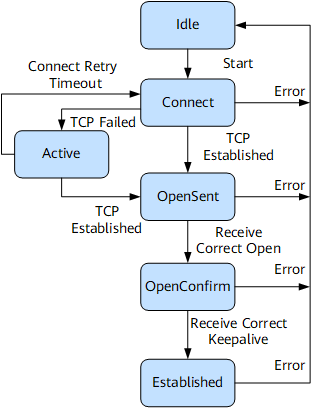

# BGP 协议

边界网关协议BGP（Border Gateway Protocol）是一种实现自治系统AS（Autonomous System）之间的路由可达，并选择最佳路由的距离矢量路由协议。

[TOC]

## 基本概念

外部网关协议EGP（Exterior Gateway Protocol）被用于实现在AS之间动态交换路由信息。

自治系统 AS 是在一个实体（企业、运营商等）管辖下拥有相同选路策略的 IP 网络。BGP 网络中每个 AS 都分配唯一的 AS 号，用于区分不同 AS。

BGP 因为域间路由选择的稳定性要求高，使用 TCP 作为传输层协议，端口号为 179。

### 邻居类型

BGP邻居类型按照运行方式分为EBGP（External/Exterior BGP）和IBGP（Internal/Interior BGP）。

- EBGP：运行于不同 AS 之间的 BGP。为防止 AS 间产生环路，BGP 设备接收 EBGP 对等体发送的路由时，会将带有本地AS号的路由丢弃。
- IBGP：运行于同一 AS 内部的 BGP。为防止 AS 内产生环路：
  - 从 IBGP 对等体学到的路由不会通告给其他IBGP对等体
  - 与所有IBGP对等体建立全连接。

### 报文交互角色

BGP 报文交互中的角色分为 Speaker 和 Peer 两种角色：

- Speaker：发送 BGP 报文设备称为 BGP 发言者，接受或产生新的报文信息，发布给其他 BGP Speaker。
- Peer：相互交换报文的 Speaker 之间互称对等体 Peer，多个 Peer 构成对等体组 Peer Group。

### Router ID

Router ID 用于标识 BGP 设备，IPv4 地址形式，在会话建立时发送的 Open 报文中携带。

建立会话每个设备必须有唯一的 Router ID。

## 工作原理

BGP 对等体通过报文交互，交互过程通过状态机控制。

### 报文类型

对等体通过报文交互，Keepalive 报文周期性发送，其他报文触发发送：

- Open 报文：用于建立 BGP 对等体连接。
- Update 报文：用于在对等体之间交换路由信息。
- Notification 报文：用于中断 BGP 连接。
- Keepalive 报文：用于保持 BGP 连接。
- Route-refresh 报文：用于在改变路由策略后请求对等体重新发送路由信息。只有支持路由刷新（Route-refresh）能力的 BGP 设备会发送和响应此报文。

### BGP 状态机

BGP对等体的交互过程中存在6种状态机：空闲（Idle）、连接（Connect）、活跃（Active）、Open报文已发送（OpenSent）、Open报文已确认（OpenConfirm）和连接已建立（Established）。在BGP对等体建立的过程中，通常可见的3个状态是：Idle、Active和Established。

- Idle 状态：BGP 初始态，拒绝邻居发送的连接请求，收到 Start 事件开始跟对等体 Peer 进行 TCP 连接，转到 Connect 状态。
- Connect 状态：重启连接重传定时器（Connect Retry），等待完成 TCP 连接。
  - TCP 连接成功，BGP 向对等体发送 Open 报文，转至 OpenSent 状态。
  - TCP 连接失败，转至 Active 状态，试图重新建立 TCP 连接。
  - 连接重传定时器超时，停留在 Connect 状态继续尝试建立 TCP 连接。
- Active 状态：试图建立 TCP 连接。
- OpenSent 状态：等待对等体 Peer 的 Open 报文，对 AS 号、版本号、认证码等校验。
  - 报文正确，发送 Keepalive 报文转至 OpenConfirm 状态。
  - 报文错误，发送 Notification 报文转至 Idle 状态。
- OpenConfirm 状态：等待 Keepalive 或 Notification 报文。
  - 收到 Keepalive 报文转至 Established 状态。
  - 收到 Notification 报文转至 Idle 状态。
- Established 状态：可以和 Peer 交换 Update、Keepalive、Route-refresh 和 Notification 报文。
  - 收到正确的 Update 或 Keepalive 报文认为正常运行。
  - 收到错误的 Update 或 Keepalive 报文，发送 Notification 报文转至 Idle 状态。
  - 收到 Notification 报文转至 Idle 状态。

### 对等体交互原则

BGP 设备将最优路由加入 BGP 路由表，与对等体建立邻居关系后的交互原则：

- 从 IBGP Peer 获取的路由只发布给 EBGP 对等体。
- 从 EBGP Peer 获取的路由发布给所有 EBGP 和 IGBP Peer。
- 多条有效路由只发布最优路由给 Peer。
- 路由更新只发布更新的 BGP 路由。
- 所有 Peer 发送的路由都会接收。

## BGP 与 IGP 交互

BGP 与 IGP 使用不同路由表，通过路由表的相互引入实现不同 AS 间的相互通讯。

### BGP 引入 IGP 路由

BGP 协议本身不发现路由，需要将其他路由引入 BGP 路由表，实现 AS 间路由互通。

AS 需要将路由发布给其他 AS，AS 边缘路由器在 BGP 路由表中引入 IGP 路由，使用路由策略进行路由过滤和路由属性设置。

- Import 方式：按协议类型引入路由，可以引入静态路由和直连路由。
- Network 方式：逐条将 IP 路由表存在的路由引入 BGP 路由表。

### IGP 引入 BGP 路由

AS 需要引入其他 AS 的路由，AS 边缘路由器在 IGP 路由表中引入 BGP 路由。

使用路由策略进行路由过滤和路由属性设置。

## 路由选择策略

BGP 路由表到达同一目的地可能存在多条路由，BGP 会通过路由优选规则比较 BGP 属性，选择最佳路由发送给对等体。

### BGP 属性

路由属性是对路由的特定描述。

#### 公认必须遵循属性

公认必须遵循的属性是所有 BGP 设备都要识别的属性类型，必须存在 Update 报文中，缺少属性路由信息错误：

- Origin 属性：定义路径信息来源，标记路由怎么成为 BGP 路由。
  - IGP：最高优先级，通过命令注入 BGP 路由表。
  - EGP：通过 EGP 得到的路由信息。
  - Incomplete：优先级最低，其他方式学习的路由信息。
- AS_Path 属性：矢量顺序记录路由从本地到目的地经过的 AS 编号。设备发现 AS_Path 中有本 AS 号则不接受，避免路由环路。
  - Speaker 传播自身引入路由：
    - Speaker 通告 EBGP Peer，Update 报文中创建携带本地 AS 号的 AS_Path 列表。
    - Speaker 通告 IBGP Peer，Update 报文中创建空的 AS_Path 列表。
  - Speaker 传播从 Update 报文学习的路由：
    - Speaker 通告 EBGP Peer，Update 报文中本地 AS 号添加到 AS_Path 最前面。
    - Speaker 通告 IBGP Peer，不改变路由的 AS_Path 属性。
- Next_Hop 属性：记录路由下一条信息（不一定是邻居设备 IP 地址）。
  - Speaker 向 EBGP Peer 通告路由时，设置为本地与对端建立 BGP 邻居关系的接口地址。
  - Speaker 向 IBGP Peer 通告本地始发路由时，设置为本地与对端建立 BGP 邻居关系的接口地址。
  - Speaker 向 IBGP Peer 通告学习到的路由时，不改变路由信息下一跳属性。

#### 公认任意属性

所有 BGP 设备都可以识别此类属性，但 Update 报文中可以缺少该属性，路由信息不会错误。

- Local_Pref 属性：表明路由器的 BGP 优先级，判断流量离开 AS 的最佳路由。
  - BGP 设备通过不同 IBGP Peer 得到目的地址相同但下一跳不同的路由，优先选择 Local_Pref 高的路由。
  - 仅在 IBGP Peer 之间有效，不通告给其他 AS。

#### 可选过渡属性

可以不识别此类属性，但会接收并通告给其他对等体。

- 团体属性：标识相同特征的 BGP 路由，使路由策略应用更加灵活。

#### 可选非过渡属性

可以不识别此类属性，忽略该属性且不会通告给其他对等体。

- MED 属性：判断流量进入 AS 的最佳路由。
  - 相同条件下选择 MED 值较小的作为最佳路由。
  - 在相邻两个 AS 之间传递，不会通告给其他 AS。
- Originator_ID 属性和 Cluster_List 属性：解决路由反射器场景的环路问题。

### BGP 路由选择策略

同一目的地存在多条路由，BGP 按照下列属性选择路由：

1. 优选本地优先级（Local_Pref）最高的路由。
2. 依次优选手动聚合路由、自动聚合路由和命令引入路由，从 Peer 学习的路由。
3. 优选 AS 路径（AS_Path）最短的路由。
4. 依次优选 Origin 类型为 IGP、EGP、Incomplete 的路由。
5. 来自同一 AS 的路由，优选 MED 值最低的路由。
6. 依次优选 EBGP 路由、IBGP 路由、LocalCross 路由、RemoteCross 路由。
7. 优选到 BGP 下一跳 IGP 度量值（metric）最小的路由。
8. 优选 Cluster_List 最短的路由。
9. 优选 Router ID 最小的设备发布的路由。
10. 优选从具有最小 IP Address 的对等体学来的路由。

### 负载分担

到达
