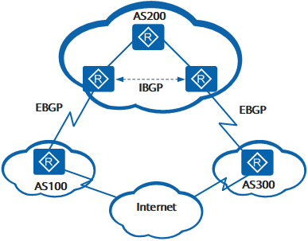

# BGP 协议

边界网关协议BGP（Border Gateway Protocol）是一种实现自治系统AS（Autonomous System）之间的路由可达，并选择最佳路由的距离矢量路由协议。

[TOC]

## 基本概念

外部网关协议EGP（Exterior Gateway Protocol）被用于实现在AS之间动态交换路由信息。

自治系统 AS 是在一个实体（企业、运营商等）管辖下拥有相同选路策略的 IP 网络。BGP 网络中每个 AS 都分配唯一的 AS 号，用于区分不同 AS。

BGP 因为域间路由选择的稳定性要求高，使用 TCP 作为传输层协议，端口号为 179。

### 邻居类型

BGP邻居类型按照运行方式分为EBGP（External/Exterior BGP）和IBGP（Internal/Interior BGP）。

- EBGP：运行于不同 AS 之间的 BGP。为防止 AS 间产生环路，BGP 设备接收 EBGP 对等体发送的路由时，会将带有本地AS号的路由丢弃。
- IBGP：运行于同一 AS 内部的 BGP。为防止 AS 内产生环路：
  - 从 IBGP 对等体学到的路由不会通告给其他IBGP对等体
  - 与所有IBGP对等体建立全连接。

### 报文交互角色

BGP 报文交互中的角色分为 Speaker 和 Peer 两种角色：

- Speaker：发送 BGP 报文设备称为 BGP 发言者，接受或产生新的报文信息，发布给其他 BGP Speaker。
- Peer：相互交换报文的 Speaker 之间互称对等体 Peer，多个 Peer 构成对等体组 Peer Group。

### Router ID

Router ID 用于标识 BGP 设备，IPv4 地址形式，在会话建立时发送的 Open 报文中携带。

建立会话每个设备必须有唯一的 Router ID。

## 工作原理

BGP 对等体通过报文交互，交互过程通过状态机控制。

### 报文类型

对等体通过报文交互，Keepalive 报文周期性发送，其他报文触发发送：

- Open 报文：用于建立 BGP 对等体连接。
- Update 报文：用于在对等体之间交换路由信息。
- Notification 报文：用于中断 BGP 连接。
- Keepalive 报文：用于保持 BGP 连接。
- Route-refresh 报文：用于在改变路由策略后请求对等体重新发送路由信息。只有支持路由刷新（Route-refresh）能力的 BGP 设备会发送和响应此报文。

### BGP 状态机

