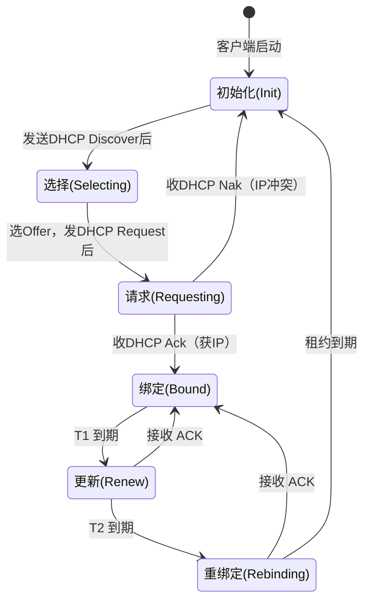

# DHCP 协议

DHCP（Dynamic Host Configuration Protocol，动态主机配置协议）协议是用于**自动分配网络配置参数**的应用层协议。

[TOC]

## 核心特性

DHCP 协议的核心功能是为局域网内的终端设备（如 PC、手机、服务器）动态分配 IP 地址、子网掩码、网关、DNS 服务器等网络参数，避免手动配置的繁琐与错误，同时实现 IP 地址的高效复用。

DHCP 是客户端/服务器协议：

- DHCP 服务器：端口号 67，负责管理 IP 地址池，存储网络配置参数，响应终端的地址请求并分配资源。
- DHCP 客户端：端口号 68，发送 DHCP 报文向服务器请求网络配置。
- IP Pool：预先分配的一个连续的 IP 地址范围。
- 租约：DHCP 服务器分配给客户端的 IP 地址存在使用期限。

## 报文格式

DHCP 消息格式定义采用扩展 BOOTP 以保持协议兼容性，消息格式包括一个固定长度的初始部分和一个可变长度的选项字段。

```bash
0         7            15        23       31
+------------------------------------------+
|  Op(1)  |  Htype(1)  | Hlen(1) | Hops(1) |
+------------------------------------------|
|                    Xid(4)                |
+------------------------------------------|
|        Secs(2)      |      Flags(2)      |
+------------------------------------------|
|                 Ciaddr(4)                |
+------------------------------------------|
|                 Yiaddr(4)                |
+------------------------------------------|
|                 Siaddr(4)                |
+------------------------------------------|
|                 Giaddr(4)                |
+------------------------------------------+
|                 Chaddr(16)               |
+------------------------------------------+
|                 Sname(64)                |
+------------------------------------------|
|                 File(128)                |
+------------------------------------------+
|           Options(variable)              |
+------------------------------------------+
```

- Op 操作字段：1 为请求报文，2 为应答报文。
- Htype 字段表示硬件类型，1 表示以太网。
- Hlen 字段硬件地址长度，MAC 地址为 6 字节。
- Hops 字段保存消息传输进过 DHCP 中继的数目，客户端设置为 0。
- Xid 字段表示事务 ID，客户端设置一个随机数并由服务端返回，匹配应答和请求。
- Secs 字段表示客户端从开始获取地址或地址续租更新后所用的时间，单位是秒。
- Flags 只有最高位使用，0 表示客户端请求服务端以单播形式发送响应报文，1 表示服务端以广播形式发送。
- Ciaddr 客户端的IPv4地址。只有客户端是Bound、Renew、Rebinding状态，并且能响应ARP请求时，才能被填充，否则为 0。
- Yiaddr 表示服务器分配的 IP 地址。
- Siaddr 表明 DHCP 协议流程的下一个阶段要使用的服务器的 IPv4 地址。
- Giaddr 表示第一个DHCP中继的IPv4地址。客户端和服务端不在同一网段时，第一个 DHCP 中继在将 DHCP 请求转发给服务器时填写。服务器根据该地址网段分配合适的地址。
- Chaddr 字段表示客户端的MAC地址。
- Sname 字段表示客户端获取配置信息的服务器名字。
- File 字段表示客户端的启动配置文件名。
- Options 字段表示DHCP的选项字段，至少为312字节，格式为"代码+长度+数据"。

## DHCP 协议操作

DHCP 客户端基于 UDP 协议，与服务器进行四次交互（DORA 过程，Discover → Offer → Request → Acknowledge）获取 IP 地址并完成配置。

### DHCP Discover

客户端设备启动或接入网络后，未配置任何 IP 地址，需要通过广播报文寻找网络中的 DHCP 服务器获取配置。

- Ciaddr：0.0.0.0，此时客户端未配置 IP 地址。
- 目的 IP 地址 255.255.255.255 发送广播报文寻找 DHCP 服务器。
- 随机生成事务 ID（Xid）用于匹配响应报文。
- 选项字段 Type = 53，Value = 1 标识 Discover 报文。

若网段内存在多个 DHCP 服务器，所有服务器接收到报文后都会回复。

### DHCP Offer

DHCP 服务器接收到 Discover 报文后，向局域网内所有设备发送广播报文，并附带完整的网络配置等待客户端确认。

- Yiaddr 字段填写分配的 IP 地址。
- 选项字段 Type = 53，Value = 2 标识 Offer 报文。
- 选项字段 Type = 51 标识 IP 租用期，单位为秒，客户端需要在到期前续租。
- 选项中还包括子网掩码（Type = 1）、网关 IP 地址（Type = 3）、DNS 服务器地址（Type = 6）。

### DHCP Request

DHCP 客户端决定接收服务器发送的 Offer 报文，通过广播 DHCP Request 报文告知所有服务器选择的 IP 地址。

IP 地址租期过半后，客户端也会发送 DHCP Request 报文进行续租。

- Ciaddr 字段首次请求时填写 0.0.0.0，续租时填写正在使用的 IP 地址。
- Yiaddr 字段填写 0.0.0.0，该字段只能服务端填写。
- Siaddr 字段填写选择的 DHCP 服务器 IP 地址。
- 选项字段 Type = 53，Value = 3 标识 Request 报文。
- 选项字段 Type = 54 标识客户端选择的 DHCP 服务器 IP 地址。
- 选项字段 Type = 50 标识分配的 IP 地址。

### DHCP ACK

DHCP 服务端接收到 Request 报文后，确认 IP 地址仍可用后发送 DHCP ACK 报文，客户端收到后正式配置 IP 地址使用网络。

⚠️注意：DHCP 服务端向客户端发送 ACK 报文前，需要执行 ARP 探测来确保分配的 IP 地址没有被其他设备占用，避免 IP 冲突。

DHCP ACK 报文除了包含客户端网络参数外，明确了 IP 地址的租用期限。

- Yiaddr 字段填写分配的 IP 地址。
- Siaddr 字段填写 DHCP 服务器 IP 地址，用于客户端续租时通信。
- 选项字段 Type = 53，Value = 5 标识 ACK 报文。
- 选项字段 Type = 51 标识 IP 地址的租用时间。

### DHCP 状态机

DHCP 客户端使用状态机控制获取 IP 地址流程，确保客户端能动态、稳定地获取网络配置。




**初始化状态（Init State）**

客户端首次启动或 IP 地址租约到期后，无有效的 IP 地址和网络配置。

此时客户端发送 DHCP Discover 广播包向服务端请求 IP 地址，发送完后立即进入选择状态。

**选择状态（Selecting State）**

客户端选择状态下等待 DHCP 服务器的响应。

该状态下客户端可能接收多个 DHCP Offer 广播包，需要从多个 Offer 中选择一个，发送 DHCP Request 广播包。

**请求状态（Requesting State）**

客户端发送 Request 报文后进入请求状态，等待目标服务器的最终确认。

目标服务端接收到 Request 报文后，检查 IP 是否被占用：

- 未被占用：发送 DHCP ACK 广播包，正式分配 IP，客户端进入绑定状态。
- 已占用：发送 DHCP Nak 拒绝报文，客户端返回初始化状态重新发送 Discover 报文。

其他服务端收到 Request 报文后收回已发送的 Offer，释放对应的 IP 地址。

**绑定状态（Bound State）**

客户端接收到 DHCP ACK 报文后成功获取 IP 地址和网络配置，可以正常使用网络。

DHCP ACK 报文中包含租期的超时时间，进入绑定状态后 IP 租期开始计时，租期到 50% 时候进入更新状态。

**更新状态（Renewing State）**

到达租期的 50% 时刻后，客户端向分配 DHCP 服务端发送 DHCP Renew 续租单播数据包，请求延长租期。

服务端返回应答报文后，客户端重新进入绑定状态。

到达租期的 87.5% 时刻后仍未收到服务端返回应答报文，进入重绑定状态。

**重绑定状态（Rebinding State）**

发送 DHCP Rebind 重绑定广播包发给所有 DHCP 服务端请求续租。

服务端返回应答报文后，客户端重新进入绑定状态。

租期到期后仍未收到服务端返回应答报文，客户端重新进入初始化状态发送 Discover 报文获取 IP 地址。

## DHCP 中继

DHCP 中继全称是**DHCP Relay Agent（DHCP 中继代理）**，是部署在 “客户端所在网段” 与 “DHCP 服务器所在网段” 之间的网络设备（通常是路由器、三层交换机）。

### 核心作用

DHCP 协议默认基于广播机制，但路由器等三层设备为避免广播风暴，默认不会转发二层广播包，这会导致不同子网的 DHCP 客户端无法与跨子网的 DHCP 服务器通信。

DHCP 中继的核心作用是在不同网络段（子网）之间转发 DHCP 消息，解决 DHCP 服务器与客户端跨子网通信的问题，避免为每个子网单独部署 DHCP 服务器，降低网络部署和维护成本。

### 工作原理

接收客户端发送的**DHCP 广播消息**，将其转换为**单播消息**转发给指定的 DHCP 服务器；再将服务器返回的单播响应消息，转换为广播消息发送给客户端，完成 IP 地址分配流程。

1. **客户端发送 DHCP Discover**：客户端启动后无 IP 地址，通过二层广播发送 DHCP Discover 报文。
2. **中继设备接收并处理消息**：与客户端同子网的 DHCP 中继设备接收到广播报文后，识别其为 DHCP 消息：
   - 将二层广播封装改为三层单播，目标 IP 设为预先配置的 DHCP 服务器 IP 地址。
   - 在消息中添加 Giaddr 网关地址字段（中继设备与客户端子网接口 IP 地址），用于告知 DHCP 服务器客户端所属的子网。
3. **DHCP 服务器返回 Offer 报文**：服务器根据 Giaddr 确定客户端所属子网，在地址池中分配 IP 地址等配置参数，生成 DHCP Offer 报文以单播方式发送给 DHCP 中继设备。
4. **中继转发响应至客户端**：中继设备接收 DHCP Offer 报文后，将其转换为二层广播发送到客户端所在子网，客户端接收并确认配置，完成 IP 地址获取。

