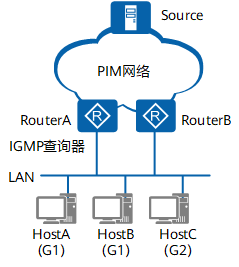

# IGMP 协议

互联网组管理协议 IGMP 是负责 IPv4 组播成员管理协议，用来在接收者主机和与其直接相邻的组播路由器之间建立和维护组播组成员关系。

[TOC]

## 协议原理

IGMP 报文封装在 IP 报文，通过在接收者主机和组播路由器之间交互 IGMP 报文实现组成员管理。

组播通信的发送者不需要关注接收者位置，由 IGMP 管理接收者加入响应的组播组，建立组播组成员关系。

### IGMP 版本

- IGMPv1 定义基本组成员查询和报告过程；
- IGMPv2 增加了查询器选举和组成员离开机制；
- IGMPv3 增加成员可以指定接收或指定不接受某些组播源报文。

### 报文类型

IGMPv1 定义了两种类型报文：

- 普遍组查询报文（General Query）：查询器向所有主机和路由器发送查询报文，获取组播组存在的成员。
- 成员报告报文（Report）：主机向查询器发送报告报文，用于申请加入某个组播组或者应答查询报文。

IGMPv2 增加两种报文：

- 成员离开报文（Leave）：成员离开组播组时主动向查询器发送的报文，宣告自己离开某组播组。
- 特定组查询报文（Group-Specific Query）：查询器向网段内指定组播组发送的查询报文，用于查询该组播组是否存在成员。

查询报文增加最大响应时间字段，用于控制成员对查询报文的响应速度。

### 工作机制

一个网段内有多个组播路由器，只需要选举其中一台组播路由器发送查询报文。

由组播路由协议 PIM 选举唯一的组播信息转发者 DR 作为查询器，负责网段组成员关系查询。

#### 普通组查询与响应

IGMP 查询器了解网段内有哪些组播组存在成员。

1. IGMP 查询器发送目的地址为 224.0.0.1（表示同一网段内所有主机和路由器）的普遍组查询报文（周期发送）；收到该查询报文的组成员启动定时器。
2. 第一个定时器超时的组成员发送报告报文。
3. IGMP 查询器接收报告报文后，了解到本网段内存在组播组 G1 的成员，组播路由协议生成 `(*，G1)` 组播转发表项。网络中一旦有组播组G1的数据到达路由器，将向该网段转发。

#### 新组成员加入机制

主机 Host C 加入组播组 G2 的过程：

1. 主机主动发送报告报文声明加入 G2 组播组。
2. 查询器收到报告报文生成组播转发项 `(*，G2)`。

#### 组成员离开机制

IGMPv1 没有定义离开组报文，查询器周期性发送查询报文，未收到报告报文后一段时间删除组播转发项。

IGMPv2 增加离开组机制：

1. 主机主动向查询器发送成员离开报文；
2. 查询器针对离开组发送特定组查询报文。
3. 如果组内还有其他成员回复报告报文，继续维护组成员关系，否则将组播转发表项老化。

#### 查询器选举机制

IGMPv2 使用独立查询器选举机制，网段上存在多个组播路由器时，IP地址最小的路由器成为查询器。
