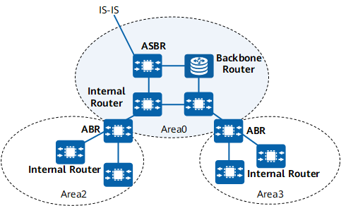

# OSPF 协议

OSPF 开放式最短路径优先是基于**链路状态**的内部网关协议（IGP），在自治系统 AS 内部用于路由器之间交换信息并计算最优路径。

[TOC]

## 基本概念

OSPF 协议采用 SPF 算法（Dijkstra 算法），以链路状态数据库 LSDB 为基础生成路由表。

IPv4 协议使用 OSPF Version 2，IPv6 协议使用 OSPF Version 3。

### 核心特性

RIP 协议基于距离矢量算法的路由协议，存在着收敛慢、路由环路、可扩展性差等问题。

OSPF 基于链路状态的协议解决 RIP 的问题，应用于规模中等的网络，最多支持几百台设备。

核心特性包括：

- 采用组播收发报文，减少对其他不运行 OSPF 路由器的影响。
- 无类路由协议，支持 VLSM 和 CIDR，能高效利用 IP 地址空间。
- 链路状态协议，路由器仅交换直连链路的状态（接口 IP、带宽、开销）而非完整路由表。
- 区域划分，将 AS 划分为多个区域 Area，降低 LSDB 的规模和 SPF 计算复杂度。
- 路由开销基于接口带宽计算（bps），带宽越高开销越小。

### Router ID

Router ID是一个32比特无符号整数，是一台设备在自治系统中的唯一标识。

可以手动配置和设备自动设定两种方式，设备从系统 ID 或者当前接口 IP 地址自动选择。

### 区域划分

大型网络运行 OSPF 路由协议时，设备数量增多会导致链路状态数据库 LSDB 庞大，运行 SPF 算法复杂度增加。网络规模增大拓扑结构容易发生变化，造成网络中有大量 OSPF 协议报文传递，降低网络带宽利用率。每次变化都会导致网络中所有设备重新计算路由。

OSPF 协议将 AS 划分为不同区域解决 LSDB 频繁更新问题，提交网络利用率。

区域是从逻辑上将设备划分为不同组。

- 区域号（Area ID）标识不同区域。
- 区域的边界是设备而不是链路。
- 一个网段（链路）只能属于一个区域，运行 OSPF 协议的接口必须指明区域。

区域类型：

- 普通区域：默认情况 OSPF 区域被定义为普通区域。
  - 标准区域：传输区域内路由，区域间路由和外部路由。
  - 骨干区域：连接所有其他 OSPF 区域的中央区域，Area 0 表示。负责区域之间的路由，非骨干区域之间的路由信息必须通过骨干区域转发。
- Stub 区域：位于 AS 的边界，只有一个 ABR 的非骨干区域。
  - ABR 不向区域内传播接收的 AS 外部路由，减少区域内设备的路由表规模和路由传递报文。
  - ABR 发送缺省路由给区域内其他设备，用于访问外部。
- NSSA 区域：非完全末梢区域是 Stub 区域的扩展。
  - ASBR 产生 Type7 LSA 携带外部路由信息在区域内传播。Type7 LSA 到达 ABR 时转换为 Type5 LSA 泛红到整个 OSPF 域。

### 设备角色

根据设备在 AS 中的不同位置，可以划分为不同角色。

- 区域内路由器：设备所有接口都属于同一个 OSPF 区域。
- 区域边界路由器 ABR：连接骨干区域和非骨干区域，同属于骨干区域和非骨干区域。
- 骨干路由器：至少一个接口属于骨干区域。ABR 和骨干区域内的路由器都属于骨干路由器。
- AS 边界路由器 ASBR：与其他 AS 交换路由信息，可能是区域内路由器，也可能是 ABR。

### 链路状态通告 LSA

OSPF 对路由信息的描述封装在链路状态通告 LSA（Link State Advertisement）中发布出去。

- Router-LSA（Type1）：每个设备都会产生，描述设备的链路状态和开销，在设备所在区域内传播。
- Network-LSA（Type2）：DR 产生，描述本网段状态，在 DR 所在区域传播。
- Network-summary-LSA（Type3）： ABR 产生，描述区域内某个网段的路由，并通告给其他区域。
- ASBR-summary-LSA（Type4）：ABR 产生，描述本区域到其他区域中的 ASBR 的路由，通告给除 ASBR 所在区域的其他区域。
- AS-external-LSA（Type5）：ASBR 产生，描述 AS 外部路由，通告到所有区域。
- NSSA LSA（Type7）：ASBR 产生，描述 AS 外部路由，在 NSSA 区域内传播。

### 报文类型

OSPF 使用 IP 报文封装协议报文，协议号为 89。

- Hello 报文：周期发送，发现和维持邻居关系。

