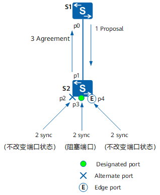

# STP 生成树协议

STP（Spanning Tree Protocol，生成树协议）是二层以太网的核心链路冗余与环路防护协议，由 IEEE 制定标准（IEEE 802.1D），其核心目标是**在存在冗余链路的局域网中，通过逻辑上阻塞部分端口，消除数据链路层环路，同时保留冗余路径以应对链路故障**。

[TOC]

## 解决问题

以太网交换机在二层转发依赖 MAC 地址表，如果网络中存在物理环路则会引发问题：

- **广播风暴**：广播帧在环路上无限转发，占用所有带宽；
- **MAC 地址漂移**：交换机不断更新 MAC 地址表，导致地址表不稳定；
- **重复帧接收**：终端会收到同一数据帧的多个副本，造成数据错误。

STP 的解决方案是**构建一棵无环的逻辑生成树**：将网络中的交换机视为节点、链路视为边，通过算法选举出根节点和最优路径，阻塞其他冗余链路，当主链路故障时，自动启用备用链路。

## 核心概念

运行 STP 协议的网络中，设备被称为网桥，每个网桥都有一个 BID，由桥优先级和桥 MAC 地址构成。

- 根网桥：生成树计算的基准节点，由交换网络选举出唯一根网桥，其他交换机以根网桥为目标，计算最短路径并阻塞冗余链路。
- 根端口：非根网桥上指向根网桥的最优路径端口，用来接收根网桥的 BPDU 并转发数据，每个非根网桥只会选举出一个根端口。
- 指定网桥：与本机直接相连并负责向本机转发配置消息的设备。
- 指定端口：指定网桥向本级转发配置消息的端口。
- 路径成本：链路带宽的映射，带宽越高，成本越低，用来选举根端口。

### 网桥协议数据单元

BPDU（Bridge Protocol Data Unit，网桥协议数据单元）是 **STP/RSTP/MSTP 协议的核心通信载体**，交换机通过周期性发送和接收 BPDU，实现根网桥选举、端口角色确定（根端口 / 指定端口 / 阻塞端口）、拓扑变化感知等核心功能。

BPDU 帧目的 MAC 地址是组播地址：`01-80-C2-00-00-00`。

- Root Identifier：当前根桥的 BID。
- Root Path Cost：根路径开销，STP 协议选举根端口。根路径开销就是某端口到根桥所经过的各个桥上的各端口路径开销的累加值。
- Bridge Identifier：本交换设备的 BID。
- Port Identifier：发送该 BPDU 的端口 ID。

### 端口状态和角色

运行 STP 协议存在五种端口状态：

- Disabled：端口 Down，不处理 BPDU 报文，也不转发流量。端口 Down 或者去使能 STP 会进入该状态。
- Blocking：端口 UP 或使能 STP 后会进入 Blocking 状态，该状态只能接收并处理 BPDU 报文。
- Listening：端口被选举为根端口或指定端口后进入 Listening 状态，开始计算生成树，端口只可以接收发送 BPDU 报文。
- Learning：Forward Delay 定时器超时后，开始建立 MAC 地址转发表，不转发用户流量。
- Forwarding：Learning 状态下 Forward Delay 定时器超时后进入 Forwarding 状态，此时可以接收和发送 BPDU，转发用户流量。

## 建立生成树

在 STP 网络中，选举根网桥、根端口和指定端口使用 BPDU 报文中的**根桥 ID，根路径开销，发送设备 BID，发送端口 PID**。

运行 STP 协议的设备之间通过选举根桥 ID 字段最小的网桥作为根网桥。

1. **初始化阶段**

网桥初始化阶段，所有交换机默认认为自己是根网桥，向外发送配置 BPDU 广播自身信息，将根桥 ID 设置为自己的网桥 ID。

2. **选举根桥**

交换机收到邻居的配置 BPDU 报文后，比较自身的根桥 ID 和收到的根桥 ID，如果收到的根桥 ID 更小，更是自身的根桥 ID 为收到的根桥 ID，并将路径开销加上端口的链路开销后，向其他端口转发该 BPDU。

经过全网 BPDU 交互后，最终所有交换机统一认可根桥 ID 最小的交换机为根桥。

3. **选举根端口**

根端口是非根桥上到根桥路径开销最小的端口，每个非根桥设备有且只有一个根端口，负责向根桥转发数据。

- 非根桥接受来自不同端口的 BPDU，计算每个端口的根路径开销。
- 对比所有端口的开销，选出开销最小的端口作为根端口。

4. **选举指定端口**

指定端口是每个链路上负责转发数据的端口，根桥设备所有端口默认都是指定端口。

- 每条链路的交换机端口互相发送 BPDU，对比 BPDU 优先级，最优的端口成为指定端口。
- 指定端口经过 Listening 和 Learning 状态后进入 Forwarding 状态可以转发数据，其他端口进入 Blocking 状态防止环路。

## RSTP 快速生成树协议

STP协议的收敛速度慢：

- 依赖定时器等待的方式判断拓扑变化。
- 稳定的拓扑中，由根桥主动发出配置BPDU报文，非根桥设备只能被动中继配置BPDU报文将其并传遍整个STP网络。

### RSTP 端口角色状态

相比 STP 协议，RSTP 增加了两种端口角色：

- **Alternate端口**：由于学习到其它网桥发送的配置BPDU报文而阻塞的端口，作为根端口的备份端口。
- **Backup端口**：由于学习到自己发送的配置BPDU报文而阻塞的端口，作为指定端口的备份。

RSTP 将端口状态缩减为 3 种，根据端口是否转发用户流量和学习 MAC 地址，端口状态分为：

- **Discarding**：端口既不转发用户流量也不学习MAC地址；
- **Learning**：端口不转发用户流量但是学习MAC地址；
- **Forwarding**：端口既转发用户流量又学习MAC地址。

### 快速收敛机制

检测拓扑是否发生变化只有一个标准：一个非边缘端口迁移到 Forwarding 状态。

> **非边缘端口（Non-Edge Port）**可以主动收发 BPDU，参与根桥选举、端口角色判定、计算链路优先级。STP 状态切换需要有 30 秒延迟避免临时环路，RSTP 可快速进入可转发的状态。
>
> **边缘端口（Edge Port）**专门连接终端设备，跳过生成树的复杂收敛流程。

拓扑发生变化：

- 本设备非边缘端口指定端口和根端口启动 TC While TImer（Hello Time 的两倍），期间清空所有端口学习的 MAC 地址，由非边缘端口指定端口和根端口向外发送 RST BPDU，TC 置位，超时后停止发送。
- 其他设备收到 RST BPDU 后，清空所有端口学习的 MAC 地址（只保留收到 RST 端口的 MAC 地址表项），然后自己所有非边缘端口指定端口和根端口启动 TC While Timer 重复操作。

实现 RST BPDU 在网络中的泛洪。

#### Proposal/Agreement 机制

P/A 机制目的是使一个指定端口尽快进入 Forwarding 状态。

根桥 S1 和 S2 之间新添加了一条链路，P/A 机制协商过程如下：

1. p0 和 p1 先成为**指定端口**互相发送 RST BPDU。
2. p1 口收到更优的 RST BPDU 自己将成为根端口，停止发送 RST BPDU。
3. p0 进入 Discarding 状态发送 RST BPDU 把 Proposal、Agreement 置位 1。
4. S2 收到根桥发送来的携带 Proposal 的 RST BPDU，开始将自己的所有端口进入 sync 变量置位（临时阻塞边缘端口外的其他端口，阻塞指定端口 p3）。
5. p1 进入 Forwarding 状态并向 S1 返回 Agreement 置位的 RST BPDU。
6. S1 判断是刚发出 Proposal 的回应，p0 立刻进入 Forwarding 状态。

#### 根端口快速切换机制

根端口失效后，网络中最优的 Alternate 端口将成为根端口并直接进入 Forwarding 状态。

STP 模式时接口需要等待 2*Forward Delay 时间（Listening、Learning）才能进入 Forwarding 状态，RSTP 模式时的根端口快速切换机制使接口直接切换成 Forwarding 状态，减少业务流量丢包。

#### 边缘端口

指定端口位于整个网络的边缘，即不再与其他交换设备连接，而是**直接与终端设备直连**，这种端口叫做边缘端口。

边缘端口不参与 RSTP 运算，可以由 Disable 直接转到 Forwarding 状态。

边缘端口收到配置BPDU，就丧失了边缘端口属性，成为普通STP端口。
