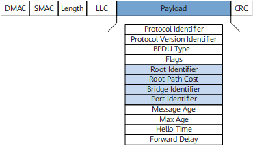
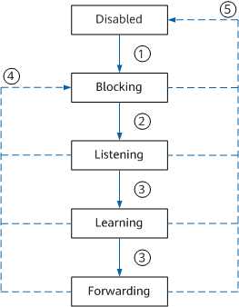

# STP 生成树协议

STP（Spanning Tree Protocol，生成树协议）是二层以太网的核心链路冗余与环路防护协议，由 IEEE 制定标准（IEEE 802.1D），其核心目标是**在存在冗余链路的局域网中，通过逻辑上阻塞部分端口，消除数据链路层环路，同时保留冗余路径以应对链路故障**。

[TOC]

## 解决问题

以太网交换机在二层转发依赖 MAC 地址表，如果网络中存在物理环路则会引发问题：

- **广播风暴**：广播帧在环路上无限转发，占用所有带宽；
- **MAC 地址漂移**：交换机不断更新 MAC 地址表，导致地址表不稳定；
- **重复帧接收**：终端会收到同一数据帧的多个副本，造成数据错误。

STP 的解决方案是**构建一棵无环的逻辑生成树**：将网络中的交换机视为节点、链路视为边，通过算法选举出根节点和最优路径，阻塞其他冗余链路，当主链路故障时，自动启用备用链路。

## 核心概念

运行 STP 协议的网络中，设备被称为网桥，每个网桥都有一个 BID，由桥优先级和桥 MAC 地址构成。

- 根网桥：生成树计算的基准节点，由交换网络选举出唯一根网桥，其他交换机以根网桥为目标，计算最短路径并阻塞冗余链路。
- 根端口：非根网桥上指向根网桥的最优路径端口，用来接收根网桥的 BPDU 并转发数据，每个非根网桥只会选举出一个根端口。
- 指定网桥：与本机直接相连并负责向本机转发配置消息的设备。
- 指定端口：指定网桥向本级转发配置消息的端口。
- 路径成本：链路带宽的映射，带宽越高，成本越低，用来选举根端口。

### 网桥协议数据单元

BPDU（Bridge Protocol Data Unit，网桥协议数据单元）是 **STP/RSTP/MSTP 协议的核心通信载体**，交换机通过周期性发送和接收 BPDU，实现根网桥选举、端口角色确定（根端口 / 指定端口 / 阻塞端口）、拓扑变化感知等核心功能。

BPDU 帧目的 MAC 地址是组播地址：`01-80-C2-00-00-00`。

- Root Identifier：当前根桥的 BID。
- Root Path Cost：根路径开销，STP 协议选举根端口。根路径开销就是某端口到根桥所经过的各个桥上的各端口路径开销的累加值。
- Bridge Identifier：本交换设备的 BID。
- Port Identifier：发送该 BPDU 的端口 ID。

### 端口状态和角色

运行 STP 协议存在五种端口状态：

- Disabled：端口 Down，不处理 BPDU 报文，也不转发流量。端口 Down 或者去使能 STP 会进入该状态。
- Blocking：端口 UP 或使能 STP 后会进入 Blocking 状态，该状态只能接收并处理 BPDU 报文。
- Listening：端口被选举为根端口或指定端口后进入 Listening 状态，开始计算生成树，端口只可以接收发送 BPDU 报文。
- Learning：Forward Delay 定时器超时后，开始建立 MAC 地址转发表，不转发用户流量。
- Forwarding：Learning 状态下 Forward Delay 定时器超时后进入 Forwarding 状态，此时可以接收和发送 BPDU，转发用户流量。

## 建立生成树

在 STP 网络中，选举根网桥、根端口和指定端口使用 BPDU 报文中的**根桥 ID，根路径开销，发送设备 BID，发送端口 PID**。

运行 STP 协议的设备之间通过选举根桥 ID 字段最小的网桥作为根网桥。

1. **初始化阶段**

网桥初始化阶段，所有交换机默认认为自己是根网桥，向外发送 BPDU 时将根桥 ID 设置为自己的网桥 ID。

2. **选举根桥**

检测到 ID 更小的网桥后，基于接收到 ID 更小的帧构造下一次发送的 BPDU。

接收到根 ID 更小的端口设置为根端口，剩余端口设置为阻塞或转发状态。

