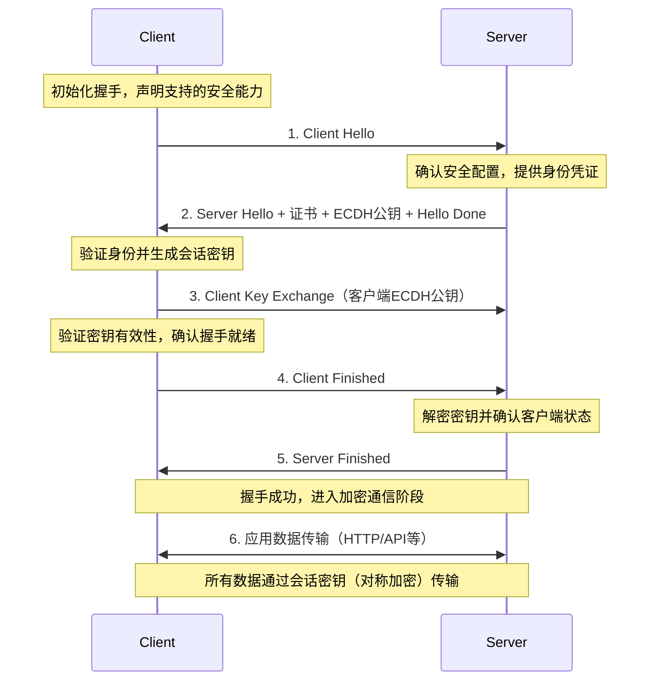

# TLS 协议

TLS（Transport Layer Security） 协议是基于 SSL 协议的升级，在传输层和应用层之间，为 TCP 连接提供加密、身份验证和数据完整性校验，解决网络传输中的数据安全问题。

1. **加密数据**：通过对称加密算法对传输的实际数据进行加密，防止第三方窃听后读懂内容。
2. **验证身份**：借助数字证书，让客户端确认服务器的真实身份，避免连接到钓鱼网站。
3. **保障完整**：使用哈希算法生成数据 “指纹”，确保数据在传输中未被篡改（如插入恶意代码、修改内容）。

[TOC]

## 版本演进

SSL 协议（安全套接层协议）是早期用于 Web 通信加密的协议，由于存在严重的安全漏洞且无标准化维护，目前已经被 TLS 协议替代。

TLS 1.0 基于 SSL 3.0 改进，修复部分漏洞。

TLS 1.1 修复 BEAST 漏洞，优化加密流程。

TLS 1.2 是目前应用最广泛的，支持更安全的加密套件（AES-GCM），强化哈希算法（淘汰 MD5 和 SHA-1）。

TLS 1.3 简化握手流程，一次往返即可完成。

## 核心架构

TSL 协议采用分层设计，上层为握手协议负责建立连接，完成身份验证、协商加密算法和交换密钥。下层为记录协议负责数据传输，对应用层发送的消息进行加密传输、增加校验值。

### 握手协议

握手协议是连接建立阶段的核心，负责在传输数据前完成加密信息的交换。

#### 握手流程

TLS1.3 版本通过简化握手流程，在一次 RTT 往返时间就可完成握手。

1. **客户端发起请求（Client Hello）**

客户端向服务器发送初始消息包括：

- 支持的 TLS 版本；
- 支持的加密套件列表（如 `TLS_AES_256_GCM_SHA384`，优先选安全性高的）；
- 客户端随机数，用于生成会话密钥；
- SNI（服务器域名指示），方便服务器在多域名部署时返回正确的证书。

2. **服务器响应（Server Hello + 证书 + 密钥参数 + Hello Done）**

服务器根据客户端请求返回组合消息：

- **Server Hello**：确认使用的 TLS 版本和加密套件，同时发送服务器随机数；
- **服务器证书**：由 CA（证书机构，如 Let's Encrypt）签发的数字证书，包含服务器公钥和身份信息（如域名、有效期）；
- **密钥参数（ECDH 公钥）**：TLS 1.3 强制使用 ECDHE（椭圆曲线 Diffie-Hellman）密钥交换算法，服务器在此发送自己的 ECDH 公钥；
- **Server Hello Done**：告知客户端 “服务器侧初始响应已完成”。

3. **客户端验证与密钥生成（Client Key Exchange + Finished）**

客户端收到服务器消息后，完成核心安全验证并发送关键消息：

- **验证证书**：通过本地内置的 “根 CA 证书” 验证服务器证书的合法性（如证书是否过期、签名是否有效、域名是否匹配），若验证失败则终止连接；
- **生成会话密钥**：客户端用自己的 ECDH 私钥 + 服务器的 ECDH 公钥，计算出 “预主密钥（Pre-Master Secret）”，再结合 Client Random 和 Server Random，生成最终的 “会话密钥”（对称加密密钥）；
- **Client Key Exchange**：发送客户端的 ECDH 公钥（供服务器生成相同的预主密钥）；
- **Client Finished**：用会话密钥加密 “前序所有握手消息的哈希值”，发送给服务器 —— 用于证明客户端已正确生成会话密钥，且握手数据未被篡改。

4. **服务器确认与握手完成（Server Finished）**

服务器收到客户端消息后，完成最终确认：

- **生成会话密钥**：用自己的 ECDH 私钥 + 客户端的 ECDH 公钥，计算出与客户端相同的预主密钥，再生成会话密钥；
- **验证 Client Finished**：用会话密钥解密 “Client Finished” 消息，比对哈希值是否与本地计算的一致，确认客户端身份和数据完整性；
- **Server Finished**：用会话密钥加密 “前序所有握手消息的哈希值”，发送给客户端；
- 客户端解密并验证 “Server Finished” 通过后，**握手协议正式完成**，后续数据传输进入 “记录协议” 阶段，用会话密钥加密。

#### 双向认证

对于普通 Web 网站使用单向认证，只需要服务器提供证书，客户端验证服务器身份。

双向认证：客户端也要提供证书，服务器验证客户端身份，握手流程中会增加服务器请求客户端证书和客户端发送证书的步骤。

1. **服务器请求客户端证书**：服务器返回 “Server Hello + 证书” 后，额外发送 “Certificate Request” 消息，要求客户端提供证书。
2. **客户端发送证书并证明身份**：客户端发送自己的证书，同时用客户端私钥加密 “证书验证消息”（供服务器验证客户端身份），后续步骤与单向认证一致。

### 记录协议

记录协议是 TLS 协议的数据传输底层载体，负责将应用层数据或握手协议消息，按照约定规则进行分段、压缩、加密并添加校验值。

#### 核心功能

- **消息分段**：将应用层协议发送的消息，分割成 TLS 规定的最大长度片段（默认最大 16384 字节），避免单个消息过大导致传输效率低或超时。
- **添加 MAC / 哈希值**：对消息（或未压缩的原始片段）计算 “消息认证码（MAC）” 或哈希值（如 SHA-256），用于接收方验证数据是否被篡改。
- **加密**：用握手阶段协商的 “会话密钥” 和加密套件，对 “消息片段 + MAC / 哈希值” 进行加密（对称加密，如 AES-GCM、ChaCha20-Poly1305），保障数据机密性。
- **添加记录头**：对加密后的数据包添加 TLS 记录头（5 字节），包含：
  - 内容类型（1 字节）：标识承载的消息类型（如握手消息、应用数据、警报消息）。
  - TLS 版本（2 字节）：如 0x0304 代表 TLS 1.3，0x0303 代表 TLS 1.2。
  - 长度（2 字节）：标识后续加密数据的字节数。
