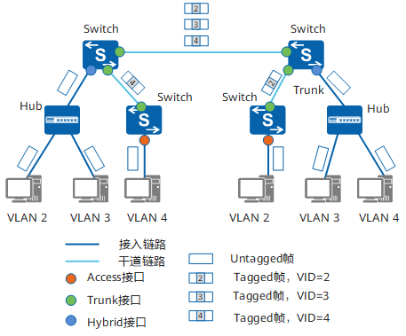

# 虚拟局域网

虚拟局域网（VLAN）遵循 IEEE 802.1Q 标准，不改变物理网络拓扑，仅通过交换机配置，将物理局域网隔离成多个独立广播域。每个 VLAN 相当于一个独立的局域网，内部设备可自由通信，不同 VLAN 间默认无法直接访问，需通过路由器转发。

VLAN具备以下优点：

- **限制广播域**：广播域被限制在一个VLAN内，节省了带宽，提高了网络处理能力。
- **增强局域网的安全性**：不同VLAN内的报文在传输时相互隔离，即一个VLAN内的用户不能和其它VLAN内的用户直接通信。
- **提高了网络的健壮性**：故障被限制在一个VLAN内，本VLAN内的故障不会影响其他VLAN的正常工作。
- **灵活构建虚拟工作组**：用VLAN可以划分不同的用户到不同的工作组，同一工作组的用户也不必局限于某一固定的物理范围，网络构建和维护更方便灵活。

[TOC]

## VLAN 标签

VLAN 报文需要添加标签字段交换机才能识别不同 VLAN 报文，交换机内部处理的数据帧都是带标签的帧。报文结构如下：

```bash
          +-----------+----------+--------+-----------+
          |   TPID    |   PRI    |  CFI   |    VID    |
          |  2 Bytes  |  3 Bits  | 1 Bits |  12 Bits  |
          +-----------+----------+--------+-----------+
          |                                           |
                        |              |
+-----------+-----------+--------------+---------------+------+-----------+----------+
|   DMAC    |   SMAC    |  802.1Q Tag  |  Length/Type  |       Data       |   FCS    |
|  6 Bytes  |  6 Bytes  |   4 Bytes    |    2 Bytes    |  Variable length | 4 Bytes  |
+-----------+-----------+--------------+---------------+------+-----------+----------+
```

- 标签协议标识 TPID：0x8100 表示 802.1Q Tag（VLAN）帧。
- QoS 优先级：0-7，优先级主要为QoS差分服务提供参考依据，阻塞时优先发送优先级高的数据包。
- 标准格式指示 CFI：表示MAC地址是否是标准格式，0 表示标准格式。
- VID：VLAN ID 表示帧所属 VLAN，范围为1-4094，0 和 4905 为协议保留。

## 链路类型

现网中交换机连接的设备有些只会发送 Untagged 帧，交换机的接口需要识别 Untagged 帧。根据接口连接对象和收发数据帧处理，接口链路类型分为：Access、Trunk、Hybrid 和 QinQ，适应不同连接和组网。



### Access 接口

Access 接口与用户终端设备相连，大部分情况只能收发 Untagged 帧，而且只能为 Untagged 帧添加唯一 VLAN 的标签。

交换机内部只能处理 Tagged 帧，Access 接口需要给收到的数据帧添加缺省 VLAN ID（PVID）：

- 收到 Tagged 帧：VID 与 PVID 相同时才会接收，否则直接丢弃。
- 收到 Untagged 帧：接收后打上 PVID。
- 发送报文：直接将标签剥离。

### Trunk 接口

Trunk 接口又称为干路接口，一般用于连接交换器、路由器等能够发送 Tagged 帧和 Untagged 帧的网络设备，可以允许多个 VLAN 帧带标签通过，但只允许一个 VLAN 帧从该类接口上发出时不带标签。

- 收到 Tagged 帧：VID 在接口允许通过的 VLAN ID 列表接收报文，否则直接丢弃报文。
- 收到 Untagged 帧：打上 PVID 且 PVID 在接口允许通过的 VLAN ID 列表接收报文，否则直接丢弃报文。
- 发送报文：标签 VID 与 PVID 相同时剥离标签发送，否则携带原有标签发送。

### Hybrid 接口

Hybrid 接口既可以用于连接不能识别标签的用户终端设备，也可以用于连接可以收发 Tagged 帧和 Untagged 帧的交换机、路由器等设备。

Hybrid 接口接收报文的标签添加逻辑与 Trunk 接口相同，发送报文时，可以根据接口配置选择是否剥离标签发送。Hybrid 接口和 Trunk 接口在很多应用场景下可以通用。

## VLAN 划分

VLAN 可以通过接口、MAC地址、子网、网络层协议、匹配策略方式来划分。