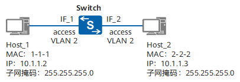
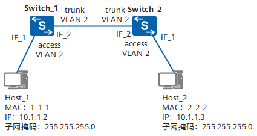
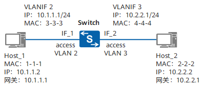
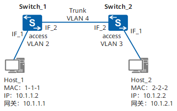

# 虚拟局域网

虚拟局域网（VLAN）遵循 IEEE 802.1Q 标准，不改变物理网络拓扑，仅通过交换机配置，将物理局域网隔离成多个独立广播域。每个 VLAN 相当于一个独立的局域网，内部设备可自由通信，不同 VLAN 间默认无法直接访问，需通过路由器转发。

VLAN具备以下优点：

- **限制广播域**：广播域被限制在一个VLAN内，节省了带宽，提高了网络处理能力。
- **增强局域网的安全性**：不同VLAN内的报文在传输时相互隔离，即一个VLAN内的用户不能和其它VLAN内的用户直接通信。
- **提高了网络的健壮性**：故障被限制在一个VLAN内，本VLAN内的故障不会影响其他VLAN的正常工作。
- **灵活构建虚拟工作组**：用VLAN可以划分不同的用户到不同的工作组，同一工作组的用户也不必局限于某一固定的物理范围，网络构建和维护更方便灵活。

[TOC]

## VLAN 标签

VLAN 报文需要添加标签字段交换机才能识别不同 VLAN 报文，交换机内部处理的数据帧都是带标签的帧。报文结构如下：

```bash
          +-----------+----------+--------+-----------+
          |   TPID    |   PRI    |  CFI   |    VID    |
          |  2 Bytes  |  3 Bits  | 1 Bits |  12 Bits  |
          +-----------+----------+--------+-----------+
          |                                           |
                        |              |
+-----------+-----------+--------------+---------------+------+-----------+----------+
|   DMAC    |   SMAC    |  802.1Q Tag  |  Length/Type  |       Data       |   FCS    |
|  6 Bytes  |  6 Bytes  |   4 Bytes    |    2 Bytes    |  Variable length | 4 Bytes  |
+-----------+-----------+--------------+---------------+------+-----------+----------+
```

- 标签协议标识 TPID：0x8100 表示 802.1Q Tag（VLAN）帧。
- QoS 优先级：0-7，优先级主要为QoS差分服务提供参考依据，阻塞时优先发送优先级高的数据包。
- 标准格式指示 CFI：表示MAC地址是否是标准格式，0 表示标准格式。
- VID：VLAN ID 表示帧所属 VLAN，范围为1-4094，0 和 4905 为协议保留。

## 链路类型

现网中交换机连接的设备有些只会发送 Untagged 帧，交换机的接口需要识别 Untagged 帧。根据接口连接对象和收发数据帧处理，接口链路类型分为：Access、Trunk、Hybrid 和 QinQ，适应不同连接和组网。


### Access 接口

Access 接口与用户终端设备相连，大部分情况只能收发 Untagged 帧，而且只能为 Untagged 帧添加唯一 VLAN 的标签。

交换机内部只能处理 Tagged 帧，Access 接口需要给收到的数据帧添加缺省 VLAN ID（PVID）：

- 收到 Tagged 帧：VID 与 PVID 相同时才会接收，否则直接丢弃。
- 收到 Untagged 帧：接收后打上 PVID。
- 发送报文：直接将标签剥离。

### Trunk 接口

Trunk 接口又称为干路接口，一般用于连接交换器、路由器等能够发送 Tagged 帧和 Untagged 帧的网络设备，可以允许多个 VLAN 帧带标签通过，但只允许一个 VLAN 帧从该类接口上发出时不带标签。

- 收到 Tagged 帧：VID 在接口允许通过的 VLAN ID 列表接收报文，否则直接丢弃报文。
- 收到 Untagged 帧：打上 PVID 且 PVID 在接口允许通过的 VLAN ID 列表接收报文，否则直接丢弃报文。
- 发送报文：标签 VID 与 PVID 相同时剥离标签发送，否则携带原有标签发送。

### Hybrid 接口

Hybrid 接口既可以用于连接不能识别标签的用户终端设备，也可以用于连接可以收发 Tagged 帧和 Untagged 帧的交换机、路由器等设备。

Hybrid 接口接收报文的标签添加逻辑与 Trunk 接口相同，发送报文时，可以根据接口配置选择是否剥离标签发送。Hybrid 接口和 Trunk 接口在很多应用场景下可以通用。

## VLAN 划分

VLAN 可以通过接口、MAC 地址、子网、网络层协议、匹配策略方式来划分。

- 基于接口划分：交换机每个接口配置 PVID，数据帧进入交换机如果没有带标签，则默认打上接口指定 PVID 的标签。
- 基于 MAC 地址划分：配置 MAC 地址与 VLAN ID 映射关系，根据数据帧源 MAC 地址添加指定 VLAN 标签。
- 基于子网划分：配置 IP 地址与 VLAN ID 映射关系，根据数据帧源 IP 地址和子网掩码添加指定 VLAN 标签。
- 基于协议划分：配置以太网帧的协议域和 VLAN ID 映射关系，根据数据帧所属的协议（族）类型及封装格式来划分VLAN。
- 基于匹配策略划分：配置接口、MAC地址、IP地址多种组合策略匹配收到的数据帧，添加指定 VLAN 标签。

如果入方向数据帧同时匹配多种划分 VLAN 方式，匹配的优先级为：匹配策略划分 > MAC 地址划分或子网划分 > 协议划分 > 接口划分。

## VLAN 互访

用户主机发送报文前，将自己的 IP 地址与目的主机的 IP 地址进行比较，如果在同一网段，会自动获取目的主机的 MAC 地址，并将其作为目的 MAC 地址封装进报文，如果不同网段，则获取网关 MAC 地址作为目的 MAC 地址。

交换机根据接收报文的目的 MAC 地址和 VID 以及三层转发标记为判断进行二层交换还是三层交换：

- 目的 MAC 地址和 VID 匹配到 MAC 表条目，则判断转发标记。
  - 三层交换：根据报文目的 IP 地址查找三层转发表（FIB 表），如果没找到上送 CPU 查找路由表实现三层转发。
  - 二层交换：直接将报文根据 MAC 表出接口转发出去。
- 目的 MAC 地址和 VID 没有匹配到 MAC 表条目，向所有允许 VID 的接口广播该报文，获取目的主机的 MAC 地址。

### VLAN 内互访

划分 VLAN 后广播报文只在同一 VLAN 内二层转发，根据属于同一 VLAN 主机是否连接在不同交换机，VLAN 内互访场景分为：同设备VLAN内互访和跨设备VLAN内互访。

#### 同设备VLAN内互访

用户主机 Host_1 和 Host_2 连接在同台交换机上，属于同一 VLAN2，且位于相同网段，连接接口均设置为 Access 接口。



1. 主机 Host_1 向 Host_2 发送报文前首先发送 ARP 广播请求获取主机 Host_2 的 MAC 地址。
2. 交换机收到 ARP 请求报文后，将报文源 MAC 地址、VID 和接口对应关系（1-1-1, 2, IF_1）记录在 MAC 表中。
3. 交换机收到 Host_2 的 ARP 应答报文后，将 Host_2 主机的 MAC 地址、VID 和接口对应关系（2-2-2, 2, IF_2）记录在 MAC 表，然后查找到之前记录在 MAC 表中 Host_1 的出接口进行转发报文。

#### 跨设备 VLAN 内互访

用户主机Host_1和Host_2连接在不同的交换机上，属于同一个VLAN2，且位于相同网段。交换机之间通过干道链路连接。



1. Switch_1 设备的 IF_2 接口发出 ARP 请求报文前，接口的 PVID = 1（缺省值）与报文 VID 不同，不剥离报文标签直接透传到 Switch_2 的 IF_2 接口。

2. Switch_2 的 IF_2 接口收到该报文后，判断报文标签中的 VID = 2 是接口允许通过的 VLAN，接收该报文。

**干道链路**除可传输多个 VLAN 的数据帧外，还起到**透传 VLAN 的作用**，即干道链路上，数据帧只会转发，不会发生 Tag 的添加或剥离。

### VLAN 间互访

不同 VLAN 内的用户需要借助三层路由技术或 VLAN 转换技术才能实现互访。

- VLANIF 接口：三层逻辑接口，每个 VLAN 对应一个 VLANIF，并为 VLANIF 配置 IP 地址后作为本 VLAN 内用户的网关，跨网段报文进行 IP 地址三层转发。需要指定 IP 子网网段，VLAN 间的用户不能处于同一网段，浪费 IP 地址。
- Dot1q 终结子接口：适用通过三层以太网接口下接多个 VLAN 网络的环境，不同 VLAN 数据会通过同一个以太口，网络繁忙会导致通信瓶颈。
- VLAN 聚合（Super VLAN）：一个物理网络内，使用多个 VLAN（Sub-VLAN）隔离广播域，将 Sub-VLAN 聚合为一个逻辑的 VLAN（Super-VLAN），Sub-VLAN 使用同一个 IP 子网和缺省网关，节约 IP 地址资源。

#### 同设备 VLAN 间互访

互访的源主机 Host_1 和目的主机 Host_2 连接在同一台三层交换机上，分别属于 VLAN2 和 VLAN3，并位于不同的网段。



1. 主机 Host_1 发送报文目的 IP 地址跟自己是不同网段，则向网关发送 ARP 请求报文获取网关 MAC 地址。完成 ARP 请求后，交换机 MAC 表中保存 Host_1 的 MAC 地址、VID 和接口对应关系。
2. 交换机收到主机 Host_1 发送的报文后，查找到 MAC 表条目后进行三层转发，根据目的 IP 在三层转发表没有找到后上送给 CPU 查找路由表。
3. 路由表中发现直连网段（VLANIF3 所在网段）后向该网段对应 VLAN3 的所有接口发送 ARP 请求获取 Host_1 发送目的 IP 地址对应的 MAC 地址。
4. 交换机完成 ARP 请求后，添加 VID = 3 的标签后将 Host_1 的报文转发给 Host_2，保存主机 Host_2 的 IP、MAC、VID 和出接口关系到三层转发表中。

#### 跨设备 VLAN 间互访

VLANIF 接口的 IP 地址只能在交换机上生成直连路由，当不同 VLAN 的用户跨多台三层交换机互访时，除配置VLANIF 接口的 IP 地址外，还需要**配置静态路由或运行动态路由协议**。



两台交换机除了配置 VLANIF 接口的 IP 地址外，还需要配置两个接口之间的静态路由才能通信。

1. Switch_1 的 CPU 根据报文目的 IP 地址查找路由表，匹配到目的网段的下一条为 Switch_2 的 VLANIF4 的IP地址，向 VLANIF4 所在 VLAN 中的所有接口发送 ARP 请求。
2. Switch_1 完成 ARP 请求后将 Host_1 的报文转发给 Switch_2，报文目的 MAC 为 Switch_2 的 VLANIF4 接口的 MAC 地址，源目的 MAC 地址为 Switch_1 的 VLANIF4 接口的 MAC 地址。
3. Switch_2 收到报文后与同设备 VLAN 间互访相同。

