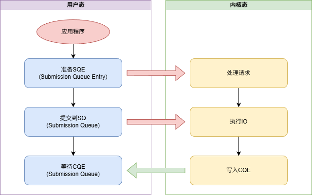

# 高性能异步 IO 框架：io_uring

`io_uring` 是 Linux 内核 5.1 版本（2019 年）引入的新一代异步 I/O 框架，旨在解决传统异步 I/O（如 `aio_read/aio_write`）的性能瓶颈、API 不统一、功能受限等问题。

[TOC]

## 传统 IO 的困境

同步 IO 发起系统调用的线程会被阻塞，直到内核完成 IO 操作并返回结果。

- **线程阻塞导致资源闲置**：阻塞期间线程无法处理其他请求，CPU 核心被限制，线程自身仍占用内存和内核资源。如果系统有 10K 个并发 IO 请求，同步模型需要创建 10K 个线程处理，内存开销急剧膨胀。
- **上下文切换开销**：IO 完成后内核需要将阻塞的线程从等待队列唤醒，触发线程上下文切换（1~10微秒/次），高并发场景上下文切换开销会占满 CPU 资源。

传统  POSIX AIO（以下简称「传统 AIO」）是 Linux 早期的异步 I/O 实现，仅支持磁盘文件的直接 IO（O_DIRECT），无法作为统一的异步框架。

> O_DIRECT：直接与磁盘交互，不通过系统页缓存。默认文件的鞋模式是非 O_DIRECT，依赖操作系统的页缓存实现数据中转，读写操作先经过页缓存而非直接读写磁盘。

传统 AIO 性能差，系统调用开销大，内核处理效率低：

- **系统调用次数多**：单个请求需调用 `aio_read()`/`aio_write()`（系统调用），获取结果需 `aio_error()`+`aio_return()`（多次系统调用）。
- **内核处理效率低**：内核需为每个请求创建内核线程（`kworker`），线程上下文切换开销大。
- **实现复杂**：API 设计存在缺陷。
  - 请求和结果需要手动维护 `struct aiocb` 结构体。
  - 错误处理需要先调用 `aio_error()` 检查是否完成，再调用 `aio_return()` 获取结果。
  - 等待结果需使用 `aio_suspend()`（仅支持信号量 / 超时）或 `sigevent` 信号回调（信号处理逻辑复杂，易引发竞态）。
  - 

## io_uring 核心设计

io_uring 通过共享内存的**环形队列**和**批量处理**来解决传统异步 IO 的性能瓶颈和功能受限等问题。

- **环形队列**：用户态和内核态共享两个环形队列——提交队列（SQ）和完成队列（CQ）。用户向 SQ 写入请求，内核从 SQ 读取并处理，完成后的结果写入 CQ，整个流程避免系统调用。
- **批量处理**：多个 IO 请求可以一次性提交，多个事件可以一次性获取，减少了用户态和内核态的切换次数。

### io_uring 工作流程

