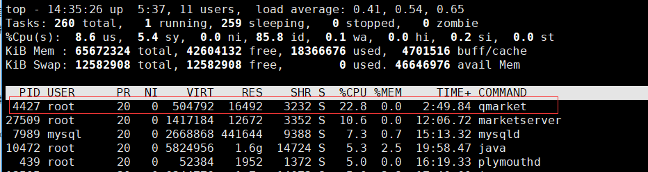

# 排查 Linux 进程 CPU 使用率过高

使用 Linux **top** 和 **pstack** 命令结合使用来排查和定位一个进程 CPU 占用率高的问题。

[TOC]

## top 命令查看 CPU 利用率

我们使用 top 命令发现我们的机器上有一个叫 qmarket 的进程 CPU 使用率非常高，如下图所示：



使用 top -H 命令再次输出系统每个进程中个线程运行状态，找到 CPU 占用率高的线程。

### top 命令详细内容

**第 1 行：任务队列信息**

```shell
top - 14:23:45 up 12 days, 4:36,  2 users,  load average: 0.00, 0.01, 0.05
```

分别是系统时间，系统运行时间，当前登录用户数。

load average 分别表示 1 分钟、5 分钟、15 分钟的系统平均负载。

**第 2 行：任务（进程）统计**

```shell
Tasks: 123 total,   1 running, 122 sleeping,   0 stopped,   0 zombie
```

123 total 总进程数，1 running 正在运行的进程数，122 sleeping 睡眠/等待的进程数，0 stopped 停止的进程数，0 zombie 僵尸进程数。

**第 3 行：CPU 统计（最关键）**

```shell
%Cpu(s):  0.3 us,  0.0 sy,  0.0 ni, 99.7 id,  0.0 wa,  0.0 hi,  0.0 si,  0.0 st
```

0.3 us 用户态进程 CPU 占比，0.0 sy 内核态 CPU 占比（系统调用、内核操作），0.0 ni 改变过优先级的进程 CPU 占比，99.7 id 空闲 CPU，0.0 wa 等待 I/O 的 CPU占比，越高表示磁盘网络瓶颈，0.0 hi 0.0 si 表示硬中断和软中断，0.0 st 虚拟机管理程序 CPU。

**第 4 行：物理内存**

```shell
MiB Mem :  3813.3 total,   345.2 free,  2786.6 used,   681.5 buff/cache
```

3813.3 total 总物理内存，345.2 free 空闲内存，2786.6 used 已使用内存，681.5 buff/cache 可回收缓存。

**第 5 行：交换分区（Swap）**

```shell
MiB Swap:  4096.0 total,  4095.7 free,     0.3 used.   720.4 avail Mem
```

**进程列表表头**

```shell
PID USER      PR  NI    VIRT    RES    SHR S  %CPU  %MEM     TIME+ COMMAND
```

- PR 表示进程优先级，越小优先级越高。
- NI：nice 值，手动设置的优先级，-20 最高优先级，19 最低优先级。
- VIRT：进程虚拟内存大小，包括代码段、数据段、共享库、换出的页以及未分配内存。
- RES：常驻物理内存，真正占用物理内存的大小。
- SHR：共享内存大小。
- S：进程状态。R - 运行；S - 睡眠；D - 不可中断睡眠（I/O）；Z - 僵尸进程；T - 停止。

## pstack 查看线程调用栈

执行 pstack + 进程号查看当前进程所有线程的调用栈：

```bash
[root@js-dev2 ~]# pstack 4427
Thread 3 (Thread 0x7f315cb39700 (LWP 4428)):
#0  0x00007f315db3d965 in pthread_cond_wait@@GLIBC_2.3.2 () from /lib64/libpthread.so.0
#1  0x00007f315d8dc82c in std::condition_variable::wait(std::unique_lock<std::mutex>&) () from /lib64/libstdc++.so.6
#2  0x0000000000467a89 in CAsyncLog::WriteThreadProc () at ../../sourcebase/utility/AsyncLog.cpp:300
#3  0x0000000000469a0f in std::_Bind_simple<void (*())()>::_M_invoke<>(std::_Index_tuple<>) (this=0xddeb60) at /usr/include/c++/4.8.2/functional:1732
#4  0x0000000000469969 in std::_Bind_simple<void (*())()>::operator()() (this=0xddeb60) at /usr/include/c++/4.8.2/functional:1720
#5  0x0000000000469902 in std::thread::_Impl<std::_Bind_simple<void (*())()> >::_M_run() (this=0xddeb48) at /usr/include/c++/4.8.2/thread:115
#6  0x00007f315d8e0070 in ?? () from /lib64/libstdc++.so.6
#7  0x00007f315db39dd5 in start_thread () from /lib64/libpthread.so.0
#8  0x00007f315d043ead in clone () from /lib64/libc.so.6
Thread 2 (Thread 0x7f3154bf8700 (LWP 4445)):
#0  0x00007f315d00ae2d in nanosleep () from /lib64/libc.so.6
#1  0x00007f315d03b704 in usleep () from /lib64/libc.so.6
#2  0x000000000043ed67 in CThread::SleepMs (this=0x7f3150001b00, nMilliseconds=1000) at ../../sourcebase/event/Thread.cpp:106
#3  0x0000000000441f82 in CEventDispatcher::Run (this=0x7f3150001b00) at ../../sourcebase/event/EventDispatcher.cpp:63
#4  0x000000000043eb33 in CThread::_ThreadEntry (pParam=0x7f3150001b00) at ../../sourcebase/event/Thread.cpp:26
#5  0x00007f315db39dd5 in start_thread () from /lib64/libpthread.so.0
#6  0x00007f315d043ead in clone () from /lib64/libc.so.6
Thread 1 (Thread 0x7f315f2ca3c0 (LWP 4427)):
#0  0x00007f315db3af47 in pthread_join () from /lib64/libpthread.so.0
#1  0x000000000043edc7 in CThread::Join (this=0x7ffc5eed32e0) at ../../sourcebase/event/Thread.cpp:130
#2  0x000000000040cc61 in main (argc=1, argv=0x7ffc5eed3668) at ../../sourceapp/qmarket/qmarket.cpp:309
```

在 pstack 输出的各个线程中，只要逐一对照我们的程序源码来梳理下该线程中是否有大多数时间都处于空转的逻辑，然后修改和优化这些逻辑就可以解决 CPU 使用率过高的问题了。

一般情况下，不工作的线程应尽量使用锁对象让其挂起，而不是空转，这样可以提高系统资源利用率。

