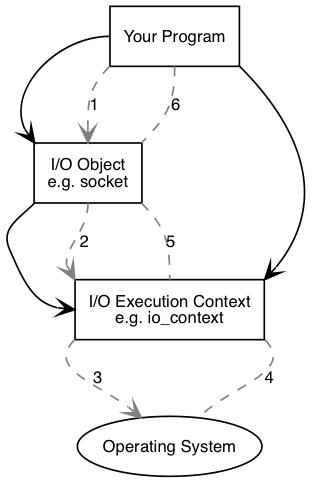

# 什么是 Boost.Asio

Boost.Asio 是一个跨平台的 C++ 库，主要用于网络编程和其他底层输入/输出（I/O）操作。它提供了一致的异步 I/O 模型，使开发者能够编写高效、可扩展的网络应用程序。

**主要特点：**

- **异步 I/O 支持**：Boost.Asio 允许开发者以异步方式处理数据，这意味着在等待某些操作完成时，程序可以继续执行其他任务，提高了应用程序的响应性和性能。
- **跨平台兼容性**：该库支持多种操作系统，包括 Windows、Linux 和 macOS，使其适用于各种平台的开发。
- **丰富的功能**：Boost.Asio 提供了对 TCP、UDP、ICMP 等协议的支持，并支持同步和异步操作，适用于构建各种类型的网络应用。

**基本组成：**

- **I/O 服务（io_service）**：Boost.Asio 的核心，负责管理所有异步操作的执行。
- **I/O 对象**：如套接字（socket）和定时器（timer），用于执行具体的 I/O 操作。

## 编译安装 

1. 在 [boost](https://archives.boost.io/release/) 官方网站下载对应版本的 Boost 库源代码。
2. 解压后进入对应目录后，执行 `bootstrap.sh` 和 `b2` 并指定安装目录。例如安装到 /home 目录。

```shell
./bootstrap.sh --prefix=/home/
./b2 install --prefix=/home/
```

配置项目的 CMakeLists.txt 文件中，添加：

```cmake
  set(BOOST_ROOT "/home")
  find_package(Boost REQUIRED COMPONENTS system)
  include_directories(${Boost_INCLUDE_DIRS})
  target_link_libraries(your_project_name ${Boost_LIBRARIES})
```

## Boost.Asio 基础

Boost.Asio 可以在 I/O 对象（如socket）上执行同步或异步操作。

程序至少有一个 **I/O 执行上下文**，表示程序连接到操作系统的 I/O 服务。

```cpp
boost::asio::io_context io_context;
```

执行 I/O 操作还需要一个 I/O 对象，例如 TCP 套接字：

```cpp
boost::asio::ip::tcp::socket socket(io_context);
```

### 同步操作

执行同步连接时，以下事件将顺序执行：



1. 程序通过调用 I/O 操作启动 connect 操作：

```cpp
socket.connect(server_endpoint);
```

2.  **I/O 对象**将请求转发到 **I/O 执行上下文**。
3. **I/O 执行上下文**调用系统调用以执行连接操作。
4. 系统调用的结果添加到 **I/O 执行上下文**中。

5. **I/O 执行上下文**将系统调用的错误结果转换为对象类型 `boost::system::error_code``error_code``false`，然后将结果转发到 I/O 对象。
6. 如果执行失败， **I/O 对象**将抛出异常。

如果入参添加获取错误码，则不会抛出异常：

```cpp
boost::system::error_code ec;
socket.connect(server_endpoint, ec);
```

同步操作示例：

```cpp
#include <boost/asio.hpp>
#include <iostream>

int main() {
    try {
        boost::asio::io_context io_context;
        boost::asio::ip::tcp::socket socket(io_context);
        boost::asio::ip::tcp::endpoint endpoint(boost::asio::ip::make_address("127.0.0.1"), 12345);
        boost::system::error_code ec;
        socket.connect(endpoint, ec);
        if (ec) {
            std::cout << "连接失败: " << ec.message() << std::endl;
            return 1;
        }
        std::cout << "连接成功!" << std::endl;
        socket.close();     // 关闭套接字
    } catch (const std::exception& e) {
        std::cout << "异常: " << e.what() << std::endl;
    }

    return 0;
}
```

### 异步操作

异步操作是与同步操作不同的事件序列：


1. 通过调用 **I/O 对象**启动 connect 的异步操作：

```cpp
socket.async_connect(server_endpoint, your_completion_handler);
```

其中 `your_completion_handler` 的函数原型为：

```cpp
void your_completion_handler(const boost::system::error_code& ec);
```

2. **I/O 对象**将请求转发到 **I/O 执行上下文**。

3. **I/O 执行上下文**调用系统调用以执行连接操作。此时与同步操作阻塞不同，异步操作会立即返回，允许其他擦操作继续执行。

   

4. 操作系统在后台尝试建立连接，连接完成后将结果放入队列中，等待 **I/O 执行上下文**来检索。
5.  **I/O 执行上下文**通过调用 `io_context.run()` 检索操作结果，其中 `io_context.run()` 会一直阻塞直到所有异步操作完成。
6. 在 `io_context.run()` 的调用过程中，**I/O 执行上下文**会从队列中取出操作结果，将其转换为 `error_code` 类型，并传递给预先定义的 `your_completion_handler` 处理程序，以便应用程序处理。

需要注意的是，`io_context.run()` 会阻塞当前线程，直到所有异步操作完成。如果希望在多个线程中并行处理异步操作，可以创建多个 `io_context` 实例，并在不同的线程中运行它们。

异步连接示例：

```cpp
#include <boost/asio.hpp>
#include <iostream>

void connect_handler(const boost::system::error_code& error)
{
    if (!error) std::cout << "连接成功！" << std::endl;
    else std::cout << "连接失败: " << error.message() << std::endl;
}

int main()
{
    try {
        boost::asio::io_context io_context;					// 创建 I/O 执行上下文
        boost::asio::ip::tcp::socket socket(io_context);	// 创建 I/O 对象
        boost::asio::ip::tcp::endpoint endpoint(boost::asio::ip::make_address("127.0.0.1"), 12345);
        socket.async_connect(endpoint, connect_handler);
        io_context.run(); // 运行 io_context 阻塞到异步操作完成
    }
    catch (const std::exception& e) {
        std::cerr << "异常: " << e.what() << std::endl;
    }
    return 0;
}
```

