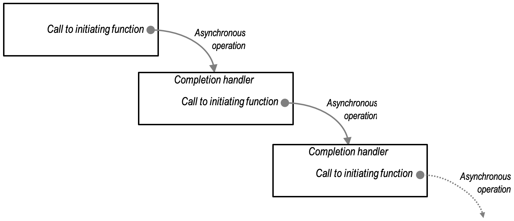

# 异步模型

Boost.Asio 库的核心是基于异步模型的，这种模型将异步操作作为构建异步组合的基本单元，同时将其与组合机制解耦。这种设计使得开发者可以灵活地选择不同的异步处理方式，如回调函数、future（包括饿汉式和懒汉式）、fibers、协程等，以满足不同场景的需求。

**异步模型的优势：**

- **高效利用系统资源：** 通过异步操作，程序可以在等待 I/O 操作完成期间执行其他任务，避免了线程阻塞，提高了系统的并发性能。
- **灵活的编程方式：** 开发者可以根据具体需求选择最适合的异步处理方式，如回调函数、future、协程等，提供了多样的编程范式。

这种异步模型的设计，使得 Boost.Asio 成为一个强大的工具，适用于需要高性能和高并发的网络编程场景。

## 异步操作

异步操作是 Boost.Asio 异步模型中的基本组成单元。异步操作表示在后台启动并执行的工作，而发起这些操作的用户代码可以继续执行其他任务。

**异步操作的生命周期：**

1. **发起函数（Initiating Function）：** 由用户调用以启动异步操作的函数。
2. **完成处理器（Completion Handler）：** 用户提供的、只能调用一次的函数对象，在异步操作完成时被调用，传递操作结果。

**同步与异步操作的语义对比：**

- **返回类型推导：** 同步操作的返回类型由函数模板及其参数决定；异步操作的完成处理器的参数类型和顺序由发起函数及其参数决定。
- **临时资源释放：** 同步操作在返回前释放临时资源；异步操作在调用完成处理器前释放临时资源。这确保了完成处理器在不与其他操作重叠使用资源的情况下启动。

## 异步代理

在 Boost.Asio 中，**异步代理（Asynchronous Agents）** 是由一系列异步操作组成的顺序结构。每个异步操作都在异步代理中执行，异步代理本身可以与其他代理并发运行。这种设计使得异步代理类似于线程在同步操作中的作用，但它们是纯粹的概念性构造，用于描述程序中异步操作的上下文和组合方式。

**异步代理的关键特性：**

- **异步操作的组合：** 异步代理将多个异步操作按顺序组合起来，每个操作完成后执行相应的完成处理程序。
- **并发执行：** 异步代理可以与其他代理并发执行，提高程序的并发性和性能。
- **概念性构造：** 异步代理用于描述异步操作的组织和调度方式，并不对应于库中的具体类型或类。

**示意图：**

可以将异步代理视为一个循环结构，不断等待异步操作完成，并执行相应的处理程序。

通过引入异步代理的概念，Boost.Asio 提供了一种高效、灵活的方式来组织和管理异步操作，使得开发者能够根据具体需求选择最适合的异步处理模型。

