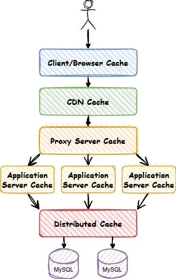

# 缓存系统

> 本文根据场景的缓存策略实现缓存系统，常见的缓存策略包括：LRU、LFU 和 ARC。

## 介绍

缓存系统是一种用来**提高数据访问速度**和**减轻后端负载**的机制。它通过**存储经常访问的数据副本**，当系统再次需要这些数据时，可以更快地获取它们，而不必重新从原始来源（比如数据库、磁盘、远程服务等）读取。

设计缓存需要牺牲一部分服务器内存，通过减少对磁盘或数据的直接访问来提升响应速度。由于服务器内存有限，所以当缓存的数据超过一定的限制后，需要制定合理的缓存淘汰策略来删除部分缓存。

### 使用场景

假设一个网站需要提高性能，缓存可以放在浏览器，反向代理服务器，还可以放在应用程序和分布式缓存系统中。



从用户请求数据到数据返回，数据经过了浏览器、CDN、代理服务器、应用服务区器和数据库的各个环节，都可以运用到缓存技术。

缓存的顺序：用户请求->HTTP缓存->CDN缓存->代理服务器缓存->进程内缓存->分布式缓存->数据库

## 缓存淘汰策略

> 访问很少的数据在完成访问后还残留在缓存中，会造成缓存空间的浪费，称为缓存污染。通过合理设计缓存策略，可以有效降低缓存污染的风险。

在缓存空间有限的情况下，淘汰策略决定了哪些数据会被移除以腾出空间。常见的缓存淘汰策略有：

- **LRU（Least Recently Used）**：移除最近最少使用的数据，适用于数据访问频率较为均衡的场景。
- **LFU（Least Frequently Used）**：移除访问频率最低的数据，更能体现数据的长期价值，但实现相对复杂。
- **FIFO（First-In, First-Out）**：先进入缓存的数据先被淘汰，算法简单，但可能不符合实际使用场景。

### FIFO

先进先出算法是一种非常简单、直观的数据淘汰策略，其基本原理是：最早进入缓存的数据优先被淘汰，就像队列中最先进入的人先被服务或出队一样。

FIFO 不考虑数据访问的频繁程度或者依然处于活跃状态，会导致高频数据被提前淘汰。

可能导致 Belady 异常，指的是在增加缓存容量的情况下，反而可能导致更高的缺页率。

### LRU

最近最少算法在缓存满的时候，有限淘汰最久未被访问的数据。

每当数据被访问时，需要更新数据的访问时间。常见的实现方式是双向链表+哈希表，通过哈希表快速定位缓存项，双向链表维持数据访问顺序，可以实现 O(1) 时间复杂度的访问、更新和删除操作。

LRU 在高并发、大数据量常见，频繁更新链表开销较大。

部分场景下无法反映数据的访问频率，造成高频数据被淘汰。例如，过去一小时中的 59 分钟都在访问同一个缓存数据，但最后一分钟访问了大量其他数据，造成前 59 分钟高频访问的数据被淘汰。

典型 LRU 实现：

```cpp
```


## 数据更新与一致性策略


## 缓存更新与刷新策略


## 参考资料

[【架构师面试-缓存与搜索-1】-缓存与缓存置换策略源码实现_自适应缓存替换算法-CSDN博客](https://blog.csdn.net/chongfa2008/article/details/121956961)